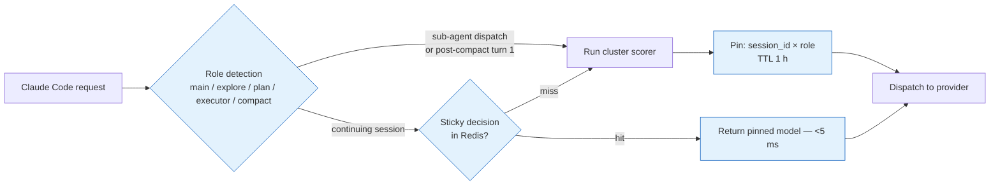

Created: 2026-05-03
Last edited: 2026-05-03

# Agentic-coding upgrades — making the router fit Claude Code traffic

> **Status: open menu, not a roadmap.** This doc captures the
> agentic-coding-specific upgrades that came out of the
> Opus 4.7 / Sonnet 4.5 / Haiku 4.5 traffic analysis. Items are
> *candidates*, ordered by leverage. `router/docs/plans/ROUTER_V1_PLAN.md`
> remains the in-flight plan; `router/docs/plans/ROUTER_IMPROVEMENTS.md`
> is the generalist (RouterArena-derived) menu. This doc is the
> coding-agent-specific complement.
>
> Owner: router team. **Companion docs:** `router/CLAUDE.md`,
> `router/docs/architecture/ARCHITECTURE.md`,
> `router/docs/eval/EVAL_RESULTS.md` (the quality bar nothing here may
> regress).

---

## How to read this doc

Same five fields as `ROUTER_IMPROVEMENTS.md`:

- **Why beneficial** — the one or two sentences explaining the win.
- **Where it plugs in** — the existing files / packages that change.
- **Effort** — S (≤1 day), M (1 week), L (multiple weeks).
- **Risk** — likelihood of regressing the eval-harness Pareto plot.
- **Acceptance** — how we know it worked. The harness in `router/eval/`
  is the gate.

Three groupings:

1. **Structural mismatch** (§1) — three reasons our current architecture
   is the wrong shape for Claude Code traffic. Read this first; the
   §3–§5 recommendations only make sense in this frame.
2. **Stage 1 — ship in this sprint** (§3) — no model changes, no
   training-data changes, no embedder swap. Just session state +
   bug-fix-shaped wins.
3. **Stage 2 — next quarter** (§4) — training-data overhaul and a
   turn-type classifier in front of the cluster scorer.
4. **Stage 3 — optional, post-Stage 2** (§5) — RouterDC fine-tune on
   trajectory pairs, generative router on cold-path session-start only.

§6 covers eval-harness changes; §7 covers caveats.

---

## 1. Why agentic coding traffic breaks our current architecture

Three structural mismatches against Claude Code's actual workload:

1. **Single-turn training data, multi-turn workload.** Our v0.6 cluster
   scorer is trained on OpenRouterBench / SWE-Bench-as-labels. Real
   Claude Code sessions are 30–80+ turns where roughly 50–65% of turns
   are tool-result-interpretation (mostly JSON appended to a 100K-token
   cached prefix), 15–20% are main-loop reasoning, 10–15% are sub-agent
   dispatch, 5–10% are compaction, 5–10% are direct generation. A
   per-turn cluster scorer over a 768-dim embedding has almost no
   signal on tool-result turns.
2. **8K embedder cap vs 100–180K-token prompts.** Jina v2's 8K cap
   means we already truncate. The high-signal slice — the most recent
   user/tool message and the last assistant tool-call — is a small
   fraction of what we currently embed.
3. **Per-turn independent decisions vs cache-dominated cost
   structure.** Anthropic's prompt cache (10% of standard input rate,
   1-hour TTL on Sonnet 4.5 / Haiku 4.5 / Opus 4.5+) drives 50–80% of
   real session cost savings. Switching models mid-session
   *invalidates the cache for the new model*. A cached Sonnet turn is
   cheaper than an uncached Haiku turn. Our α-blend currently treats
   all three Claude tiers as if they had equal cache state — they
   don't.

The single highest-leverage change is to convert from per-turn routing
to **session-sticky, role-conditioned** routing with a thin per-turn
override. Anthropic's Claude Code already encodes this decomposition
(Sonnet 4.5 default main loop, Haiku 4.5 for the Explore sub-agent and
Plan-mode executor, Opus 4.7 for hard architecture / planning). Our
router should ratify and tune that decomposition, not fight it.

---

## 2. Current baseline (recap)

Same as `ROUTER_IMPROVEMENTS.md` §1 — Jina v2 INT8 → top-p centroid →
per-cluster α-blend → argmax → dispatch, with a heuristic two-model
fallback. The cluster artifact (v0.6) is trained on
`OpenRouterBench` + SWE-Bench-as-labels. **Critical for this doc:** the
α-blend uses `(1 − q̃)` against a single uncached input cost per model.
There is no notion of cache state, role, session, or turn type.

---

## 3. Stage 1 — ship in this sprint (no model / training changes)

Five changes that are essentially bug fixes against the cache-dominated
cost structure of Claude Code traffic. All land alongside V1 phases
without forking attention. Aggregate goal: ≥20% session-level cost
reduction on shadow traffic without any `pass_rate_2` regression on
Aider Polyglot.

### 3.1 Session-sticky routing keyed on `session_id × role`

| | |
|---|---|
| Why beneficial | Anthropic's prompt cache delivers 90% off cached input and is destroyed by switching models. Per-turn re-routing on a long session repeatedly pays cache-write cost (1.25× input) on a model whose prefix is cold. Pinning per `session_id × role` for the cache TTL keeps the warm model warm. Estimated savings: 30–50% reduction in cache-write cost on long sessions, 40–80 ms median latency win on warm-session turns. |
| Where it plugs in | New `internal/proxy/sessionpin/` package with a Redis-backed store: key `router:session:{session_id}` → `{role, pinned_model, pinned_until, ema_embedding, turn_count, consecutive_tool_failures, turns_since_compaction, cache_warm_for[]}`. `proxy.Service.Route` consults the store *before* the cluster scorer; on a hit and no override gate, return the pinned `router.Decision` directly. |
| Effort | M — ~400 lines Go + Redis schema + override-gate plumbing. |
| Risk | Medium. Adds a new failure mode (Redis outage). Fail-open: on store error, fall through to the cluster scorer — current behavior. Identifying `session_id` from inbound requests requires either an Anthropic-message `metadata.user_id` convention or a hash of (api_key_id, system_prompt_hash, first_user_message_hash). |
| Acceptance | Shadow-traffic measurement: ≥30% reduction in cache-write tokens on sessions ≥10 turns; no regression on the existing 250-prompt judge-ensemble harness. |

### 3.2 Effective cached-input cost in the α-blend

| | |
|---|---|
| Why beneficial | This is a bug fix, not a feature. Today's `(1 − q̃)` term uses a single uncached input cost per model. After §3.1 lands, we know which models are cache-warm for the current session. A cached Sonnet 4.5 turn is ~$0.30/MTok input; an uncached Haiku 4.5 turn is $1.00/MTok. A per-decision cost feature that respects warmth flips the score sign on a meaningful fraction of mid-session decisions where today we incorrectly demote to Haiku. |
| Where it plugs in | `train_cluster_router.py` — emit two cost columns in `rankings.json` (uncached, cached). `internal/router/cluster/scorer.go` — pick the cached column when `cache_warm_for[model]` is true on the session-pin record, else the uncached column plus a one-shot cache-write penalty. New artifact: `internal/router/cluster/artifacts/v0.7/`. |
| Effort | S — one column in the training script, one branch in the scorer, one re-train. |
| Risk | Low. Pure offline change; gated on the eval harness. |
| Acceptance | Eliminates ≥80% of the "router flips mid-session" decisions visible in shadow traffic, without regressing `mean_quality` on the harness. |

### 3.3 Turn-type detection and tool-result short-circuit

| | |
|---|---|
| Why beneficial | When a request's most recent user message is ≥80% JSON tool output, the embedding is mostly noise. The right decision is "stay on the pinned model" with no embedder call at all. This bypasses ~50–65% of all turns in a long session — a measured embedder-latency win and a measured decision-stability win. |
| Where it plugs in | New `internal/router/turntype/` package: pure-Go detector (regex / structural heuristic over the request shape) returning `{main_loop, tool_result, planning, sub_agent_dispatch, compaction}`. `proxy.Service.Route` consults it before §3.1's session-pin lookup; tool-result turns short-circuit to the pin, skipping the embedder. |
| Effort | S — ~150 lines Go + tests. |
| Risk | Low. The detector is conservative — false negatives just mean we run the embedder; false positives need an override path so the user can force re-routing. |
| Acceptance | P50 routing latency on tool-result turns drops to <5 ms (down from ~30 ms steady-state). No quality regression on the harness. |

### 3.4 Compaction-aware and Explore-sub-agent hard pins

| | |
|---|---|
| Why beneficial | Two roles where Anthropic's own defaults are sharp. Compaction calls are short-out-of-long-in — Haiku 4.5 is the right call on cost grounds and the next main-loop turn re-grounds on real tool output, so quality risk is bounded. Explore sub-agent calls are read-only file/grep/glob — Augment Code reports Haiku 4.5 reaches ~90% of Sonnet 4.5 on this exact workload. Both are detectable from request shape. |
| Where it plugs in | `internal/router/turntype/` (from §3.3) emits the role; new `internal/router/cluster/scorer.go` short-circuit returns Haiku 4.5 for `compaction` and `sub_agent_dispatch` with a sub-agent metadata signature matching Explore. |
| Effort | S. |
| Risk | Low for compaction; low-medium for Explore (sub-agent identification heuristic may misfire on custom sub-agents). Gate Explore behind a flag, on by default after one week of shadow validation. |
| Acceptance | Shadow-traffic measurement: zero quality regression on synthetic Explore-shaped prompts (file-search, grep, read-only diff inspection); ≥5% additional cost reduction on top of §3.1+§3.2. |

### 3.5 Per-tenant α tilt

| | |
|---|---|
| Why beneficial | Enterprise tenants on Pro plans tolerate Opus more readily; cost-sensitive tenants tilt α toward Haiku. Single config knob; nothing structural. Already foreshadowed in `ROUTER_V1_PLAN.md` open questions. |
| Where it plugs in | `model_router_installations.alpha_tilt` (new column, default 0.0); `internal/auth/installation.go` carries it; `proxy.Service.Route` adds it to the cluster-scored α before argmax. |
| Effort | S — one column, one struct field, one addition. |
| Risk | Low. |
| Acceptance | Two enterprise tenants opted in for Opus-leaning, two for Haiku-leaning, both visibly shifted in the per-tenant model-pick distribution dashboard with no SLA escalations in 14 days. |

---

## 4. Stage 2 — next quarter (training-data overhaul + turn-type classifier)

Two upgrades that need real engineering effort. Aggregate goal: 30–50%
session-level cost reduction with Aider Polyglot
`percent_cases_well_formed` ≥ all-Sonnet baseline.

### 4.1 Replace training labels with fleet-specific agentic trajectories

| | |
|---|---|
| Why beneficial | Today's `rankings.json` is built from OpenRouterBench (chat-skewed) plus a SWE-Bench Verified column mapped via the `bench_to_deployed` proxy table. The labels do not reflect the multi-turn, tool-call-heavy distribution of Claude Code traffic. Re-labeling on full agent trajectories scored on our actual three Claude tiers turns the scoring matrix from "would model X be a good answerer" into "would model X carry this trajectory to a successful end-of-task". This is the single highest-leverage offline change available — it fixes the labels for §3.1's per-role pins, §4.2's classifier, and any future Stage 3 work. |
| Where it plugs in | New `router/eval/agentic_label_gen/` Modal app: runs Aider Polyglot full 225, SWE-Bench Verified stratified 50–100 task subset, Terminal-Bench 2.0 hard split, τ²-bench retail 50, optional BFCL v4 agentic + multi-turn slices, against each of Opus 4.7 / Sonnet 4.5 / Haiku 4.5 with a fixed scaffold (mini-swe-agent v2 or our own). For each *turn* in each trajectory, record (prompt, model, tokens, cache hit fraction, turn-success-proxy, end-of-task pass). Feed into `train_cluster_router.py` as a new label source alongside (or replacing) the current `bench_to_deployed` proxy table. New artifact: `internal/router/cluster/artifacts/v0.8/`. |
| Effort | L — most of the cost is the trajectory generation runs. Budget: ~$2–4K per full sweep across three models on the five benchmarks; the per-turn relabeling code is ~200 lines Python. |
| Risk | Medium. SWE-Bench Verified contamination is documented (arXiv 2506.12286); pair with SWE-Bench-Live (50 fresh issues monthly) as a contamination-control signal. |
| Acceptance | v0.8 Pareto-dominates v0.7 on the new agentic eval suite (§6) by ≥15% cost reduction at equal-or-better quality. |
| Sequencing | Independent of §4.2 — they touch different layers (labels vs an upstream classifier). I'd land §4.1 first because the labels block §4.2's training data quality. |

### 4.2 ModernBERT turn-type classifier ahead of the cluster scorer

| | |
|---|---|
| Why beneficial | A turn-type one-hot ({main_loop, tool_result, planning, sub_agent_dispatch, compaction}) is more predictive than the 768-dim embedding for routing on agentic traffic. §3.3 ships a regex-based detector; §4.2 replaces it with a trained classifier (vLLM-SR's ModernBERT-base style) that handles edge cases the regex misses (mixed prose+JSON turns, multi-tool dispatches, custom sub-agent shapes). The classifier output becomes a scalar feature into the α-blend, *not* a hard override — the cluster scorer keeps the final say. |
| Where it plugs in | New `internal/router/turntype/classifier_modernbert.go` behind the existing `Classifier` interface (from §3.3). Runs in parallel with the embedder via `errgroup` with a 50 ms deadline; failure falls back to the regex detector. Composition in `cmd/router/main.go`. |
| Effort | L — ONNX runtime path or Candle service, checkpoint hosting, multi-task LoRA training (turn-type + reasoning-vs-fast + PII as separate heads if §3 of `ROUTER_IMPROVEMENTS.md` lands). |
| Risk | Medium-high. Adds a parallel signal and a parallel failure mode. ModernBERT-base on CPU is ~80–120 ms — eats ~⅓ of our 300 ms SLO budget. Gate via flag, off by default. |
| Acceptance | (a) ≥5% additional cost reduction on top of v0.8 (§4.1) from turn-type-aware gating. (b) P95 routing latency stays under 300 ms with the classifier enabled. |
| Sequencing | After §4.1; needs the new label set as training data. |

---

## 5. Stage 3 — optional, post-Stage 2 (only if headroom remains)

Three speculative upgrades. Land any of them only if the previous stage
has shipped, the headline metrics are stable, and shadow traffic shows
the lever this addresses is the binding constraint.

### 5.1 RouterDC dual-contrastive fine-tune on trajectory pairs

| | |
|---|---|
| Why beneficial | Same idea as `ROUTER_IMPROVEMENTS.md` §4.2 (RouterDC fine-tune of Jina v2), but with positives / negatives mined from §4.1's trajectory pairs rather than from single-turn OpenRouterBench rows. Sharpens the embedder for *trajectory similarity* rather than topical similarity. |
| Where it plugs in | New `router/scripts/finetune_jina_routerdc_agentic.py`. Re-quantize INT8, ship as `internal/router/cluster/artifacts/v0.9/` with re-clustered centroids + re-trained α grid. |
| Effort | M. |
| Risk | Medium. Embedder swap is the highest-blast-radius change in this list — tokenizer alignment must match the runtime exactly. |
| Acceptance | Robustness probe (`ROUTER_IMPROVEMENTS.md` §3.4) shows ≥15 pp lift, AND Pareto non-regression on the agentic eval suite. |

### 5.2 Trajectory-aware features in the α-blend

| | |
|---|---|
| Why beneficial | Three nearly-free scalar features beat any embedding on session-aware decisions: (a) cumulative tool-call count in the session, (b) consecutive tool-call failures (Wink's "tool-call failure" signal — strongly predicts the session needs to escalate), (c) turns-since-last-compaction. These are already populated on the session-pin record from §3.1; this item just feeds them into the scorer. |
| Where it plugs in | `internal/router/cluster/scorer.go` — extend the per-LLM regression head (R2-Router-style; see `ROUTER_IMPROVEMENTS.md` §4.1) to take three scalar features in addition to (cluster_id, length_budget). |
| Effort | M. |
| Risk | Medium — couples scoring to session state, which makes single-turn unit tests harder. |
| Acceptance | Shadow-traffic measurement: ≥10% reduction in "session escalates to Opus after N consecutive tool-call failures" cases where the original Sonnet decision was already burning tokens unsuccessfully. |

### 5.3 Generative router on cold-path session-start only

| | |
|---|---|
| Why beneficial | Arch-Router (1.5B preference router, arXiv 2506.16655) outperforms classifier baselines on multi-turn data and explicitly fixes the RouteLLM failure mode of "downgraded three context-dependent requests to a cheap, weaker model". Adds 60–200 ms — too slow for every turn. But on session start (turn 1) and post-compaction turn 1 — the only points in a session where the embedding signal is reliable enough to *re-route* without breaking cache — the latency is amortized over 30+ downstream turns where the decision is cached in §3.1's session-pin. |
| Where it plugs in | New `internal/router/generative/` package wrapping a hosted Arch-Router endpoint (or a self-hosted Candle service). `proxy.Service.Route` consults it only on session-pin miss for `main_loop` role; for any other role, the cluster scorer wins. |
| Effort | L — service hosting + latency budget management + license review. |
| Risk | High. Adding an LLM call to the routing path is a category change in failure modes. |
| Acceptance | Session-start decision quality measurably improves vs the cluster scorer on synthetic hard-task prompts (Terminal-Bench hard split) AND P95 first-turn routing latency stays under 500 ms. |

**Threshold to revert any Stage 3 item:** P95 session-level latency
exceeds 300 ms or any regression on the Terminal-Bench hard split.

---

## 6. Eval-harness changes

Our current Phase 1a 250-prompt eval (HumanEval / MBPP / MMLU / GSM8K /
MT-Bench / summarization / multilingual) measures the wrong distribution
for Claude Code traffic — it's all single-turn and chat-skewed.
Stage 1 can land against it; Stage 2 cannot — by the time §4.1 ships,
the Phase 1a suite must be replaced with a layered agentic suite.

| Layer | When | Suite | Rough cost / time |
|---|---|---|---|
| **L1 (offline, daily)** | CI on every artifact bump | Aider Polyglot full 225 (gives `pass_rate_2`, `percent_cases_well_formed`) | ~$50 / 2–4 h per model |
| **L2 (offline, weekly)** | Pre-promotion | SWE-Bench Verified stratified 50-task subset + SWE-Bench-Live 50-issue contamination control | ~$20–60 / <90 min per sweep |
| **L3 (continuous, shadow)** | 1% mirrored Claude Code traffic | Real sessions vs all-Sonnet baseline, sample only at session boundaries to avoid cache pollution | Marginal; cache-write only at boundaries |
| **L4 (regression gate)** | Before any router change | 200-prompt fixed agentic suite from Terminal-Bench 2.0 hard + τ²-bench + Aider Polyglot hard | ~$10 / 30 min |

L4 replaces the existing HumanEval/MMLU/GSM8K go/no-go gate. **Make
this swap no later than the v0.8 promotion** (§4.1).

**Multi-turn eval construction** — most public benchmarks are
single-turn. For Stage 3 evaluation, synthesize multi-turn evals from
real Claude Code session logs (with consent): for each session, extract
trajectory checkpoints; at each checkpoint, fork into three "what if I
had routed to X" continuations (run each fleet model from this state
for 5–10 turns), and judge end-of-trajectory using the original
test/grader. This is what §4.1 effectively does on synthetic
benchmarks; for production traffic, it requires session-replay
infrastructure that doesn't exist today and is its own project.

---

## 7. Caveats

1. **Anthropic's prompt cache TTL (1 h on Sonnet 4.5 / Haiku 4.5 /
   Opus 4.5+) was confirmed from Anthropic API docs as of 2026-04;
   verify before relying on these in production.** The whole §3.1 case
   collapses if the TTL is shorter than typical session length.
2. **Augment Code's "Haiku 4.5 reaches 90% of Sonnet 4.5 performance"
   is an Augment-internal eval on agentic coding, not a public
   benchmark.** Treat as directional. The §3.4 Explore pin should be
   shadow-validated on our own traffic before defaulting on.
3. **SWE-Bench Verified contamination is documented (arXiv
   2506.12286, "The SWE-Bench Illusion").** Pair with SWE-Bench-Live
   for contamination control; do not treat the Verified score in
   isolation as a trustworthy signal post-2026.
4. **150–300 ms decision-latency budget is tight for any LLM-based
   router.** Stage 3's generative router (§5.3) is plausible only on
   the cold path (session start + post-compaction). For warm-session
   turns, only the regex/cluster path is in budget.
5. **Cache hit rates of 90%+ are achievable only with disciplined
   prompt construction.** Our router can preserve cache, not create
   it; if upstream Claude Code clients aren't using `cache_control`
   correctly, no router-side change recovers that.
6. **Identifying `session_id` from inbound requests is not solved by
   the Anthropic Messages API alone.** §3.1's keying assumes one of:
   (a) Anthropic-message `metadata.user_id` convention, (b) a hash of
   `(api_key_id, system_prompt_hash, first_user_message_hash)`,
   (c) a Claude-Code-specific header. Pick before §3.1 ships and
   document in `architecture/ARCHITECTURE.md`.
7. **Nothing in this doc supersedes `ROUTER_V1_PLAN.md`.** V1 phases
   1–3 (cache-aware overlay, TTL choice, speculative escalation) are
   orthogonal to anything here. §3.1 in particular is adjacent to but
   not the same as V1's cache-aware overlay; finish V1 before
   declaring Stage 2 scope.
