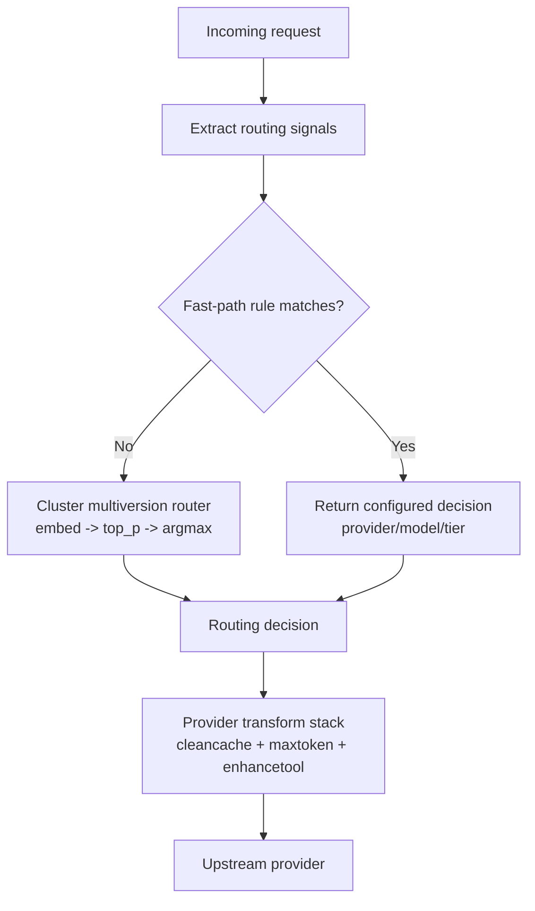

Created: 2026-05-03
Last edited: 2026-05-03

# CCR analysis and adoption plan

This document consolidates:
- `router/docs/plans/archive/CCR_COMPARISON.md`
- `router/docs/plans/archive/CCR_BORROW_FOR_PRICEPERF.md`

It keeps one source of truth for what to borrow from
`musistudio/claude-code-router` (CCR), what to avoid, and how to stage
the work without breaking the current cluster-router architecture.

---

## scope and objective

Objective: improve cost-per-quality on real Claude Code traffic without
replacing the learned cluster scorer.

Non-goals:
- turning the router into a local single-user tool
- adding runtime scripting plugins
- replacing cluster routing with static rules

---

## architecture fit

CCR is a local proxy with rich configuration and broad provider support.
Our router is a multi-tenant service with auth, telemetry, and a learned
routing core. The right strategy is selective adoption: keep our core,
adopt CCR's high-leverage patterns around fast-path routing and provider
adaptation.

---

## current gap summary

| area | CCR | router |
|---|---|---|
| routing style | rule + config scenarios | learned cluster scorer |
| runtime override | `/model`, subagent sentinel | internal eval headers only |
| provider expansion | config-first + transformer stack | code-first provider adapters |
| deployment shape | local single-user proxy | multi-tenant service |
| observability | log files | OTLP spans + structured logs |

The key takeaway from the original analysis still stands: if the model
registry only contains frontier-tier models, routing gains are capped.
Cheap-tier candidates must exist before fast-path policy work can fully
pay off.

---

## prioritized borrow plan

### tier 0 prerequisites

1. Add 2-3 cheap-tier models/providers to the registry.
2. Retrain artifacts so argmax can actually choose cheap tiers.

### tier 1 high impact

1. **Pre-cluster fast path router**
   - Signals: requested haiku tier, thinking enabled, web-search tools,
     long-context threshold.
   - Architecture: `internal/router/fastpath` wrapping cluster router.
   - Benefit: deterministic low-cost wins before embedding overhead.

2. **Subagent tier declaration**
   - Header: `x-weave-subagent-tier: cheap|reasoning|frontier`.
   - Optional prompt sentinel compatibility if needed.
   - Keep tier -> model mapping server-side.

3. **Provider transform stack (Go-native, no runtime plugins)**
   - Start with `cleancache`, `maxtoken`, `enhancetool`, `reasoning`.
   - Keep transforms pure and configured in composition root.

4. **Default-on embed input hygiene**
   - Promote `ROUTER_EMBED_LAST_USER_MESSAGE=true` once eval confirms no
     regression.

### tier 2 medium impact

1. Per-installation routing policy overrides.
2. Tokenizer registry by `(provider, model)`.
3. Session-keyed long-context stickiness from observed usage.
4. Configurable long-context threshold.

### tier 3 explicitly rejected

- Runtime JS router scripting (`CUSTOM_ROUTER_PATH` equivalent).
- Dedicated router UI in this subproject.
- Preset marketplace model.
- Image-agent work before multimodal routing is in scope.

---

## implementation roadmap

1. **Registry expansion + retrain**
   - Add cheap-tier models and produce new artifacts.
2. **Fast-path router**
   - Implement deterministic pre-cluster gating.
3. **Transform framework**
   - Introduce composable request/response transforms.
4. **Signal quality improvements**
   - Make embed-last-user-message default after eval.
5. **Policy and tokenizer upgrades**
   - Add per-installation policy + tokenizer registry + session usage.
6. **Subagent tier interface**
   - Ship header/sentinel after fast-path is proven.

---

## decision record

- Keep: learned cluster scorer as the core routing decision engine.
- Adopt: fast-path, transform-stack, and policy concepts from CCR.
- Reject: plugin-runtime and local-tool product surface.
- Track success by: cost-per-quality improvement on eval and production
  traces, not feature parity with CCR.
