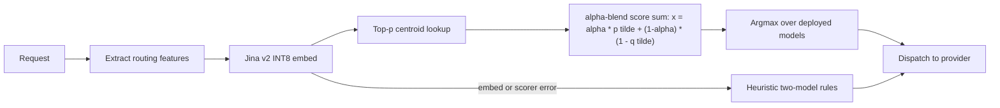
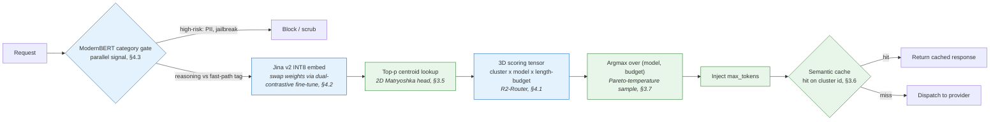
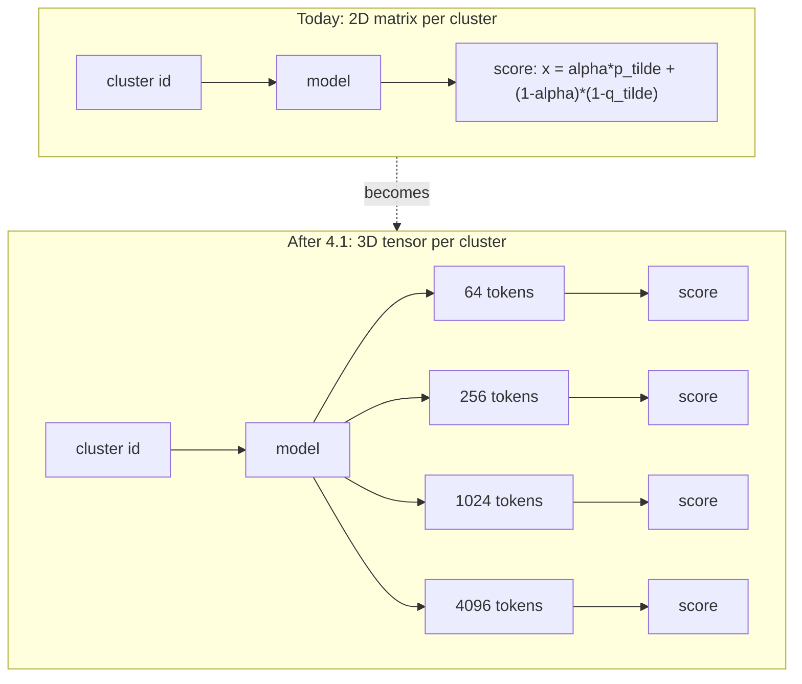
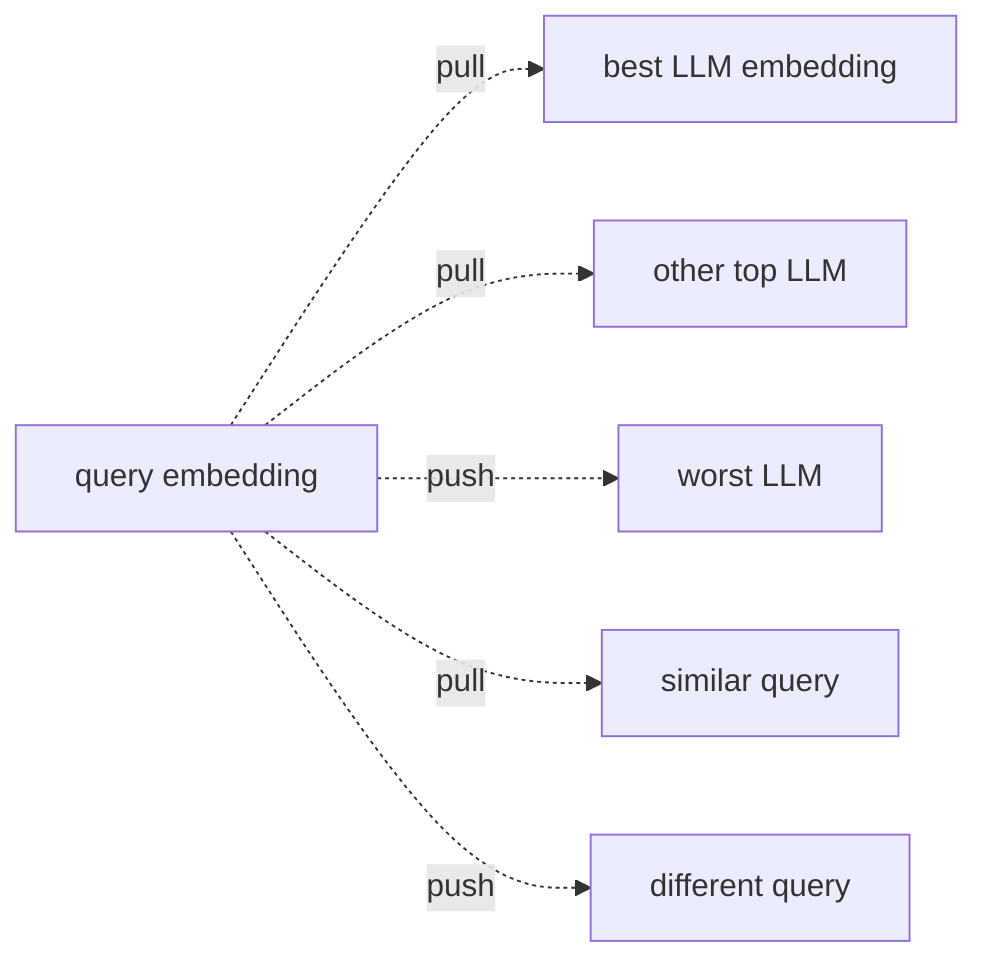
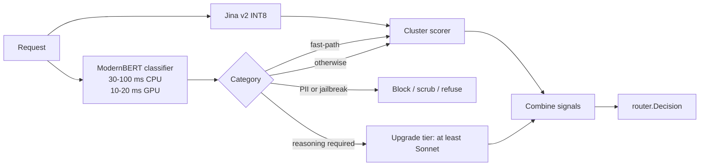
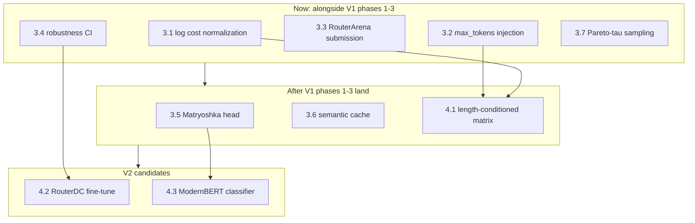

Created: 2026-05-03
Last edited: 2026-05-03

# Router improvements — menu from RouterArena competitive analysis

> **Status: open menu, not a roadmap.** This document catalogs concrete
> upgrades drawn from the RouterArena leaderboard and the surrounding
> 2024–2026 routing literature. Items here are *candidates*, not
> commitments — `router/docs/plans/ROUTER_V1_PLAN.md` is still the
> in-flight plan (Phase 4 landed early as v0.6 on 2026-05-02; Phases
> 1–3 — cache-aware overlay, TTL choice, speculative escalation — are
> unstarted).
>
> Pick from this menu when V1 phases land or when a free win is small
> enough to interleave. Owner: router team.
>
> **Companion docs:** `router/CLAUDE.md` (load-bearing layering rules);
> `router/docs/architecture/ARCHITECTURE.md`; `router/docs/eval/EVAL_RESULTS.md`
> (the quality bar nothing in here may regress).

---

## How to read this doc

Each item carries five fields so you can prioritize without re-reading
the whole research dump:

- **Why beneficial** — the one or two sentences that explain why this
  improves cost, quality, or robustness against the v0.6 baseline.
- **Where it plugs in** — the existing files and packages that change.
- **Effort** — S (≤1 day), M (1 week), L (multiple weeks).
- **Risk** — likelihood of regressing the eval-harness Pareto plot.
- **Acceptance criteria** — how we know it worked. The harness in
  `router/eval/` is the gate; numbers below are targets, not promises.

Three groupings:

1. **Free wins** (§3) — small, can land alongside V1 work without
   forking attention. Most are training-script or one-package edits.
2. **Top three upgrades** (§4) — bigger architectural changes that are
   plausible V2 phases. Each is the productionized form of a top-ranked
   leaderboard technique that is genuinely better than what we ship today.
3. **Do not adopt** (§5) — leaderboard-visible techniques that look
   attractive but are wrong for our cost-sensitive multi-tenant proxy,
   with the reason recorded so we don't relitigate.

---

## 1. Current baseline (what every improvement is measured against)

Today's stack:

- **Embedder:** Jina v2 INT8 ONNX, ~20–30 ms CPU steady-state.
- **Cluster scorer:** AvengersPro-derived; centroids + per-cluster
  ranking rows in `internal/router/cluster/artifacts/v0.6/`.
- **Cost awareness:** linear `(1 − q̃ⱼⁱ)` term in α-blend; α is
  per-cluster as of v0.6 (Phase 4 trainer:
  `scripts/train_per_cluster_alpha.py`).
- **Length awareness:** none. The router never sets `max_tokens`; it
  inherits whatever the customer's body carries.
- **Robustness signal:** none in CI. We're in the
  high-robustness family by virtue of clustered embeddings, but we
  don't measure it.
- **Last v0.6 result** (`run-f687cd8cae`, 250 prompts, judge ensemble):
  $1.91 / Pareto-dominates v0.5 ($2.85) and always-Opus ($7.84) at mean
  quality 0.856.

Where this puts us on RouterArena: directionally a productionized
UniRoute / "Universal Router" K-means baseline — top-quartile, but
with three named techniques that beat it inside our latency budget
(R2-Router, vLLM-SR, RouterDC). The improvements below close the gap
to those three.

---

## 2. How improvements attach to the existing architecture

Green nodes are §3 free wins; blue nodes are §4 top-three upgrades.
Everything else is unchanged from §1.

---

## 3. Free wins — small, can interleave with V1

### 3.1 Logarithmic cost normalization in α-blend

| | |
|---|---|
| Why beneficial | Linear cost normalization compresses the gap between Haiku ($0.25/M-input) and Sonnet ($3/M-input) far more than the gap between Sonnet and Opus ($15/M-input). Log normalization (`(log₂ c_max − log₂ c_i) / (log₂ c_max − log₂ c_min)`, the form RouterArena uses) gives Haiku a much larger cost advantage in the score sum and pulls more easy traffic off Sonnet. v0.6 already shows the model is willing to demote when α is right; this gives it a sharper lever. |
| Where it plugs in | `scripts/train_cluster_router.py` — replace `(1 − q̃)` with the log form. `scripts/train_per_cluster_alpha.py` — re-fit α grids on the new cost term. New artifact: `internal/router/cluster/artifacts/v0.7/`. |
| Effort | S — one-line change in the training script + a re-train + a holdout regret eval. |
| Risk | Low. Pure offline change; promotion gated on the eval harness. |
| Acceptance | Pareto-dominates v0.6 on the 250-prompt judge ensemble, with measurable shift in cheap-cluster traffic from Sonnet → Haiku. Cost target: ≥10% reduction below v0.6's $1.91/250. |

### 3.2 `max_tokens` injection per tier (heuristic precursor to §4.1)

| | |
|---|---|
| Why beneficial | R2-Router shows that most queries don't need 8 K-token responses, and over-tall caps cost real money on Opus/Sonnet. A heuristic `max_tokens` per tier (e.g., 256 for Haiku, 1024 for Sonnet, 4096 for Opus) gets ~70% of the §4.1 win without retraining. It also de-risks §4.1 by forcing us to confirm `max_tokens` injection at the wire-format layer before tying scoring to it. |
| Where it plugs in | `internal/translate/PrepareAnthropic` and `PrepareOpenAI` — set `max_tokens` from a per-decision `BudgetHint` field added to `router.Decision`. `internal/router/cluster/scorer.go` populates `BudgetHint` from a tier-keyed map. |
| Effort | S — one new field on `router.Decision`, one tier→budget map, two translate-site edits. |
| Risk | **Medium.** Customers can be sensitive to truncation. Gate behind `ROUTER_MAX_TOKENS_HEURISTIC` flag, default off. Validate against extended-thinking + tool-use traffic before enabling — those modes legitimately need long ceilings. |
| Acceptance | Holdout output-token reduction ≥15% on Sonnet/Opus traffic with ≤1% truncation rate (responses where the upstream returned `stop_reason=max_tokens` and the prefix was incomplete per a structural validator). |

### 3.3 RouterArena live-inference submission

| | |
|---|---|
| Why beneficial | We already have `router/eval/routerarena.py` for the routing-only pass (no grading). A full live-inference submission gets us a ground-truth rank — Acc-Cost Arena, Optimal Selection, Optimal Cost, Robustness — versus 14 published routers on the same 8,400-prompt set. The result is the highest-signal external benchmark we can run, and it tells us whether the gap between us and R2-Router/vLLM-SR is the gap the leaderboard reports or smaller (we may already be closer than the analysis assumes). |
| Where it plugs in | Extend `router/eval/routerarena.py` to (a) lift the `max_output_tokens=1` cap, (b) grade against the dataset's `Answer` column, (c) emit a leaderboard-shaped `predictions.json`. The grading harness in `router/eval/` already covers the judge-ensemble pattern. |
| Effort | M — ~$200–800 of inference for full 8,400 across one router; less if we stick to `sub_10` (809 prompts). |
| Risk | Low — read-only against staging. |
| Acceptance | Numbers exist. We're on the leaderboard or in our own internal ledger comparing apples-to-apples. Bonus: lock in the pre-improvement number as a baseline before §3.1 lands. |

### 3.4 Robustness probe in CI

| | |
|---|---|
| Why beneficial | RouterArena's robustness metric (paraphrase, typo, synonym substitution) exposes that all BERT-classifier routers regress 30–50 percentage points under perturbation. We are in the contrastive/clustered family that holds up well — but we don't measure it. A CI probe catches embedder regressions early and lets us *market* the property when it stays high. It also gates §4.2 (we expect robustness to *go up* after RouterDC fine-tuning) and §4.3 (we expect it to *go down* if we add the ModernBERT signal naïvely). |
| Where it plugs in | New `router/eval/robustness.py` that loads the existing 250-prompt set, generates 3–5 perturbation variants per prompt (use the same prompt RouterArena ships in Appendix E), runs the staging cluster scorer on both, and asserts model-selection consistency ≥85%. Wire into the eval Modal app. |
| Effort | S — one Python file + a Modal entrypoint. |
| Risk | Low. |
| Acceptance | A baseline robustness number for v0.6 exists, and the CI fails if a new artifact regresses by ≥5 pp. |

### 3.5 2D Matryoshka embedding head

| | |
|---|---|
| Why beneficial | vLLM-SR's mmBERT-Embed strategy: train the embedder so its first K dimensions are themselves a usable embedding (K ∈ {256, 512, 768}). At inference, query the truncated 256-dim head — ~50% latency reduction with negligible accuracy loss. For us this matters because §4.3's ModernBERT classifier adds latency in parallel; a faster Jina v2 buys headroom. |
| Where it plugs in | Re-export Jina v2 with a Matryoshka projection added (one extra training-time loss; inference path unchanged). Update `internal/router/cluster/embedder_onnx.go` to read a configurable `OutputDim`. Re-quantize INT8. |
| Effort | M — needs an ONNX re-export pipeline; non-trivial first time. |
| Risk | Medium — embedding swap requires re-clustering and a re-train. Gate via the existing artifact-versioning machinery. |
| Acceptance | P50 embedding latency drops ≥40% with ≤2 pp regret on the holdout vs the full-dim variant. |

### 3.6 Semantic cache keyed on cluster id

| | |
|---|---|
| Why beneficial | vLLM-SR reports 10–100× upstream-call reduction for repeated similar queries via category-aware semantic cache. For a multi-tenant proxy with shared system prompts and tool definitions, this is essentially free upstream-cost reduction. The cluster id is a natural cache partition: prompts that map to the same cluster are similar by construction. |
| Where it plugs in | New `internal/proxy/semcache/` package. Hash key = `(cluster_id, decision_model, decision_budget)`; value = recent (prompt-suffix-hash, response) pairs with a 5-minute TTL and a cosine-similarity threshold (≥0.95 on Jina v2) for hits. Lookup happens in `proxy.Service.ProxyMessages` *after* `Route` and *before* `Dispatch`. |
| Effort | M — ~300 lines Go + an LRU-backed store, plus careful handling of streaming responses (cache the full body, replay as a single SSE stream on hit). |
| Risk | **Medium-high.** Cache poisoning, cross-tenant leakage, and stale-tool-definition hits are real. Must be tenant-scoped (`api_key_id` in the key) and gated behind a flag with explicit per-customer opt-in. |
| Acceptance | ≥10% reduction in upstream calls on repeat-heavy production traffic with zero cross-tenant hit telemetry. |

### 3.7 Pareto-temperature sampling at the argmax

| | |
|---|---|
| Why beneficial | Today's argmax is brittle when two models score within 1% of each other — small input perturbations flip the decision. Sampling from the top-k along the Pareto frontier with a temperature τ (`P(j) ∝ exp(score_j / τ)`) produces a smoother decision surface, exposes natural A/B telemetry, and aligns with what RouteLLM's similarity-weighted ranking does implicitly. |
| Where it plugs in | `internal/router/cluster/scorer.go` — replace the final `argmax` with a temperature-sampled choice over the top-k. New env: `ROUTER_DECISION_TAU`, default 0 (= argmax, unchanged behavior). |
| Effort | S. |
| Risk | Low at τ=0; medium at τ>0 (changes determinism — the sticky-decision LRU in `proxy.Service` needs to consider τ in its key). |
| Acceptance | Robustness probe (§3.4) shows ≥10 pp lift at the chosen τ with no Pareto regression on the harness. |

---

## 4. Top three upgrades — V2-phase-shaped, post-V1

These are bigger. Each is the productionized form of a top-3
RouterArena technique. They are listed in the order I would actually
adopt them.

### 4.1 Length-conditioned scoring matrix (R2-Router)

**The single biggest leaderboard differentiator** — R2-Router is #1
overall and reports 4–5× cost reduction by predicting a quality-vs-cost
*curve* per LLM rather than a single scalar.

| | |
|---|---|
| Why beneficial | Powerful LLMs become *reachable* at lower cost via shorter outputs. Opus with `max_tokens=512` may dominate Sonnet at the same cost on clusters where 512 tokens is enough. Our current matrix has no way to express this — every model has a single score per cluster regardless of length. R2-Router's authors achieve Optimal Accuracy 100% in the leaderboard's own metric (i.e., never underperforms its own pool's oracle) using exactly this idea. |
| Where it plugs in | (a) Training data: re-run a sample of OpenRouterBench through each Anthropic model at each budget grid value `{128, 512, 2048, full}` and judge-score each. (b) Training script: extend `rankings.json` to `[cluster][model][budget] = score`. (c) Runtime: `internal/router/cluster/scorer.go` argmaxes over (model, budget) pairs; `router.Decision` carries `MaxTokens`. (d) Wire: `internal/translate/` injects `max_tokens` into the upstream request (already prototyped in §3.2). |
| Effort | L — most of the work is on the training-data side. The runtime change is small once §3.2 has shipped the `max_tokens` injection plumbing. |
| Risk | Medium. Length budget interacts with extended-thinking and tool-use modes in ways the R2-Router paper doesn't cover; must be validated on Claude-Sonnet-4.5-with-thinking before promotion. |
| Acceptance | Pareto-dominates v0.6 + §3.1 baseline on the harness with ≥25% cost reduction at equal or better quality, AND truncation rate ≤1% on extended-thinking traffic. |
| Sequencing | Best after §3.2 — the wire-format plumbing is exactly the same. |

### 4.2 Dual-contrastive fine-tune of Jina v2 (RouterDC)

**Sharpens the embedding space *for routing*.** Generic Jina v2 was
trained for retrieval and reranking; RouterDC's dual-contrastive
objective makes embedding space distance correlate with *which model
answers best*, not just topical similarity.

The two losses (sample-LLM and sample-sample) are summed during
training; the model and runtime path are identical to today after
re-export.

| | |
|---|---|
| Why beneficial | The Jina v2 weights aren't optimized for routing decisions. RouterDC's authors achieve $0.07/1k cost on RouterArena — the lowest on the leaderboard — using exactly this objective on a smaller encoder. Re-fitting K-means on contrastive-fine-tuned embeddings produces tighter, more route-discriminative clusters. Robustness goes up too (RouterDC: 85% vs vanilla embedder routers at 50–60%), which directly helps §3.4's CI gate. **Architecture and runtime latency are unchanged** — this is a weight swap. |
| Where it plugs in | New `router/scripts/finetune_jina_routerdc.py` that builds (query, top-k, bottom-k) triplets from the OpenRouterBench labels we already have, runs ~150 lines of contrastive PyTorch, re-quantizes INT8, and dumps a new ONNX. `internal/router/cluster/artifacts/v0.8/` carries the new embedder pointer alongside re-clustered centroids. Same versioning / rollout machinery as every prior cluster artifact. |
| Effort | M — fine-tuning run is short on a single A100, but the export + re-cluster + re-train cycle is multi-step. |
| Risk | Medium. Embedder swap is the highest-blast-radius change in this list — re-quantization and tokenizer alignment have to match the runtime exactly or `cluster.NewEmbedder` errors at boot. The build-tag pattern in `embedder_onnx.go` / `embedder_stub.go` keeps the failure mode honest. |
| Acceptance | Robustness probe (§3.4) shows ≥15 pp lift, AND Pareto non-regression on the harness. |
| Sequencing | Independent of §4.1 — they touch different layers (scoring matrix vs embedder weights). Either order works; I'd do §4.1 first because the cost lift is bigger and the change is contained. |

### 4.3 ModernBERT category classifier as parallel signal (vLLM-SR)

**Reasoning vs non-reasoning gating, plus PII / jailbreak detection
for free.** vLLM-SR is rank #2 on RouterArena and Apache-2.0 with
pre-trained checkpoints we can use directly. The trick is to run it
*alongside* the cluster scorer, not as a replacement.

| | |
|---|---|
| Why beneficial | Three wins at once. (1) Reasoning-vs-fast-path gating matches our Opus/Sonnet/Haiku tier structure perfectly; vLLM-SR reports +10.2 pp accuracy and -47% latency vs always-on-Qwen3-30B from this signal alone. (2) PII detection (Microsoft Presidio data, ~50K samples) is a compliance feature we don't have yet. (3) Jailbreak detection is a safety feature we don't have yet. The same 30 ms ModernBERT forward pass produces all three signals via multi-task LoRA heads. |
| Where it plugs in | New sibling package `internal/router/categorygate/` that holds a `Classifier` interface + a Candle-or-onnxruntime-go-backed implementation. Composition in `cmd/router/main.go` runs the classifier in parallel with `cluster.Scorer.Route` (errgroup with a 50 ms deadline; classifier failure does not block the cluster scorer). Combine in `proxy.Service.Route` *before* the sticky-decision cache check: PII/jailbreak short-circuit; reasoning hint becomes a `MinTier` constraint passed to the cluster scorer. |
| Effort | L — needs a new ONNX runtime path (or Candle service), checkpoint hosting, and careful integration so the classifier failing open doesn't break the request path. The Apache-2.0 license is fine for commercial use but each Hugging Face checkpoint card needs review. |
| Risk | Medium-high. Adding a parallel signal means adding a parallel failure mode. Latency budget: ModernBERT-base is ~80–120 ms on CPU, which eats half our budget; FastRouter-style prompt compression brings it to <50 ms but adds complexity. Gate via flag, off by default, on per-installation. |
| Acceptance | (a) ≥5% additional cost reduction on top of v0.6 + §3.1 + §4.1 from reasoning-aware gating. (b) Zero PII leakage in a red-team set of 100 PII-containing prompts. (c) P95 routing latency stays under our 300 ms SLO. |
| Sequencing | Last of the three. The §3.5 Matryoshka work buys back the latency this consumes; do that first. |

---

## 5. Do not adopt (with reasons)

| Technique | Leaderboard rank | Why we avoid |
|---|---|---|
| MIRT-BERT / NIRT-BERT (USTC IRT) | #3, #4 | Optimal Selection 3.4–3.8% — among the worst on the leaderboard. They achieve high Arena Score by skewing toward expensive models. For a cost-sensitive proxy this is the wrong objective. R2-Router (§4.1) gives equivalent accuracy with vastly better cost discipline. |
| GraphRouter (UIUC GNN) | #8 | PyTorch Geometric / DGL have no clean Go binding, so the 2.7 ms latency assumes a graph store pre-loaded in GPU memory we don't have. Lower overall accuracy (57%) and Optimal Selection (4.7%) than today. The inductive-LLM-addition story it sells is solvable in our scoring matrix with a per-LLM linear adapter — we don't need a GNN. |
| RouteLLM (binary form) | #10 | Best Optimal Selection / Cost / Robustness on the leaderboard (~99–100% on each), but it's *strictly binary* (strong vs weak). We have a 3+-model fleet (Opus / Sonnet / Haiku, plus future). The released checkpoints don't apply. The matrix-factorization *idea* underneath RouteLLM is a generalization of our scoring matrix and worth keeping in mind for v3, but the published artifact is not adoptable. |
| RouterBench-MLP / -KNN (Martian + Berkeley) | #7, #9 | Conceptually identical to what we already ship. $4.83/1k and $4.27/1k respectively make them strictly worse on the cost axis. Nothing to learn here that we don't already have. |
| CARROT-KNN (UMich + IBM) | #5 | Uses the OpenAI text-embedding-3-small API at inference time — direct latency hit (RouterArena's leaderboard explicitly calls this out for the CARROT and RouteLLM submissions). The CARROT-RoBERTa variant is fine, but it's a worse R2-Router (single-point predictor, no length curve). Skip. |

---

## 6. Sequencing recommendation

The five "now" items are independent of V1 cache work and small enough
to land between V1 phase deliverables. **§3.1 is the cheapest concrete
quality-and-cost lift in this entire document — train a v0.7 artifact
with log-cost normalization and gate it on the eval harness.** Do that
first.

§4.1 (length-conditioned matrix) is the biggest individual win in this
document; it should be the headline V2 feature *if* §3.2 has shipped
the `max_tokens` plumbing first.

§4.2 and §4.3 are independent; pick based on what we hear from
production. If quality complaints dominate, §4.2 (RouterDC fine-tune
sharpens routing-relevant similarity). If safety/compliance asks
arrive, §4.3 (ModernBERT classifier brings PII / jailbreak / category
in one pass).

---

## 7. Caveats

1. **Latency numbers in the source analysis are A100 server with
   batched evaluation.** Our Go-binary CPU production is a different
   regime; ModernBERT-base on CPU is ~3× slower than on GPU. Re-measure
   on target hardware before adopting §3.5 or §4.3.

2. **R2-Router's code was not publicly released as of February 2026.**
   §4.1 is a re-implementation from the paper; the R2-Bench training
   dataset will need to be regenerated on OpenRouterBench with
   length-conditioned `max_tokens` runs.

3. **The RouterArena dataset is generalist (8,400 queries × 9 DDC
   domains).** Our production traffic is heavier on coding and
   reasoning. The leaderboard rankings reflect a different distribution
   from ours; rerunning every promotion gate on a held-out slice of our
   own traffic is cheap and high-signal.

4. **The leaderboard's β=0.1 default heavily weights accuracy over
   cost** (10:1). For a cost-sensitive multi-tenant proxy we may care
   more about β=0.5 or β=1.0 — under those settings, vLLM-SR and
   R2-Router stay on top but the BERT-IRT routers fall further. Compute
   and publish our own β-curve when §3.3 lands.

5. **Robustness scores below ~70% should be treated with caution.**
   We're in the high-robustness family today; no improvement here
   should regress that property. §3.4's CI probe is the load-bearing
   guard.

6. **Nothing in this document supersedes `ROUTER_V1_PLAN.md`.** V1
   Phases 1–3 deliver cache-aware overlay, TTL choice, and speculative
   escalation — capabilities orthogonal to anything here. Finish V1
   before declaring V2 scope.
