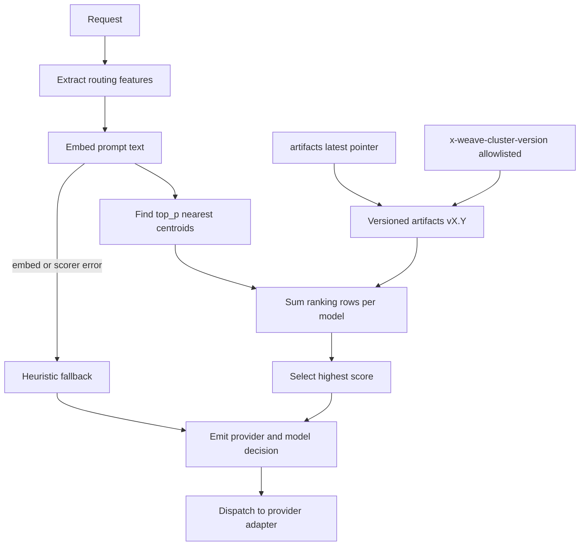
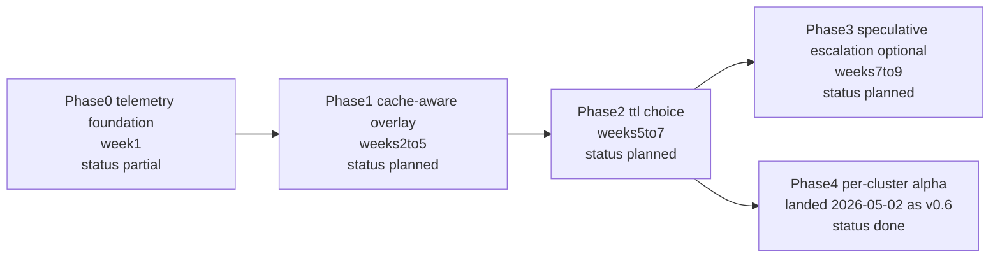

Created: 2026-05-02
Last edited: 2026-05-03

# Router v1 — Cost-Quality Frontier Plan

> **Status: In progress, refreshed May 2, 2026.** Phase 0 is partially
> landed: the OTel emitter, request-scoped span buffer, `UsageExtractor`
> wrapping on every adapter, and per-decision / per-upstream span
> recording are live in `internal/proxy/service.go`. Still pending in
> Phase 0: Anthropic cache-token fields, the Postgres
> `routing_observations` table + repo, the flags package, the telemetry
> constants package, pricing extraction, and workspace extraction. The
> `routellm` deletion landed on May 2, 2026 once the v0.6 LLM-judge eval
> recorded `CONTINUE`. **Phase 4 landed early as v0.6 on May 2, 2026**
> — per-cluster α via `scripts/train_per_cluster_alpha.py`, fit on
> bench-holdout data (re-train against Phase 1 observations once that
> phase has ≥1 month of traffic). v0.6 strictly Pareto-dominates v0.5
> in the holdout regret eval; the LLM-judge Modal eval is the next
> gate. Phases 1–3 are otherwise unstarted.
> Owner: Router team. Audience: three engineers shipping over ~10 weeks.
>
> **Supersedes:** `router/FUTURE_RESEARCH.md` (which is now historical).
> The new plan keeps Layer 3 (cache-aware switching cost) and Layer 4
> (per-cluster α / online adaptation) from FUTURE_RESEARCH but commits
> them to a phased delivery with file-level deliverables.
>
> **Companion docs:** `router/CLAUDE.md` (load-bearing layering rules —
> read first), `router/docs/eval/EVAL_RESULTS.md` (the quality bar this plan must
> not regress). The original cluster baseline plan is now archived at
> `router/docs/plans/archive/CLUSTER_ROUTING_PLAN.md`; the load-bearing parts
> are consolidated in §2.1 below and in `router/docs/architecture/ARCHITECTURE.md`.

---

## 1. What we're building

A cost-quality frontier extension to the cluster scorer that:

1. Penalises tier-switches that throw away a warm prompt-cache prefix —
   the dominant gap between current behavior and optimal on long
   Claude Code sessions.
2. Owns the cache TTL choice (5m vs 1h) per request instead of accepting
   whatever the customer's client default happens to be.
3. Tightens cluster-level α calibration so cheap clusters take the
   cheap path more aggressively.
4. (Stretch) Speculatively drafts on the cheap tier for unified-diff
   and tool-call shapes; a structural validator commits or escalates.

**Quality bar.** No regression on the eval harness Pareto plot
(`router/eval/`) — the same 500-prompt judge-ensemble setup that gates
cluster-router promotions. `router/docs/eval/EVAL_RESULTS.md` is still pending,
so no phase may claim a cleared quality baseline until that file carries
real numbers. Quality is judged by the harness, not by an abstract pp
number.

**Cost bar.** Realised blended-cost-per-session reduction, measured on
production traces ingested by the telemetry pipeline (Phase 0). The
pipeline rides on the OTel scaffolding already in tree at
`internal/observability/otel/` plus a Postgres `routing_observations`
table; Phase 0 wires both into the request lifecycle. Targets per phase
live in §5; the headline isn't a single number — it's a frontier the
eval harness must agree we moved.

---

## 2. State of the repo (May 2, 2026)

What's already done that this plan builds on:

| Surface | File / dir | What it does |
|---|---|---|
| Routing brain interface | `internal/router/router.go` | `Router.Route(ctx, Request) (Decision, error)` — single-shot, no cache awareness today |
| Cluster scorer (primary) | `internal/router/cluster/scorer.go` | AvengersPro: embed → top-p centroids → uniform sum of ranking rows → argmax; α=0.53 baked at training time into `rankings.json` |
| Heuristic fallback | `internal/router/heuristic/rules.go` | Two-model token-threshold; preserved as recovery path |
| Primary/fallback A/B switch | `internal/router/evalswitch/switch.go` | Reads context flag set by `is_eval_allowlisted` middleware |
| Multiversion router | `internal/router/cluster/multiversion.go` | Per-bundle scorers (artifacts/v0.1, v0.2, v0.3); per-request pin via `x-weave-cluster-version` |
| Proxy service | `internal/proxy/service.go` | ParseAnthropic → Route → Dispatch; 5s sticky-decision LRU keyed by api_key_id |
| Anthropic adapter | `internal/providers/anthropic/client.go` | Streaming HTTP byte-pump; the response writer is now wrapped in `otel.UsageExtractor` from `proxy.Service` so input/output tokens are captured (cache fields are still TODO) |
| Translate (wire-format) | `internal/translate/` | `RequestEnvelope`, `RoutingFeatures`, `PrepareAnthropic`/`PrepareOpenAI`; **does not emit `cache_control`** |
| Decision sidecar log | `internal/proxy/decision_log.go` | JSONL keyed by Anthropic request-id; `requested_model`, `decision_model` only — no cache fields |
| OTel scaffolding | `internal/observability/otel/` | Async OTLP/HTTP emitter (`emitter.go`), request-scoped span buffer (`buffer.go`), Anthropic-/OpenAI-aware response usage sniffer (`usage.go`), per-1M-token pricing table (`pricing.go`) |
| OTel wiring (Phase 0, done) | `cmd/router/main.go:190,460-497`, `internal/proxy/service.go` | `buildOtelEmitter()` reads `OTEL_EXPORTER_OTLP_ENDPOINT` (+ `OTEL_*` knobs) at boot; `proxy.Service` builds a request-scoped `otel.NewBuffer(emitter)`, wraps each provider response writer in `otel.NewUsageExtractor`, and records `router.decision` + `router.upstream` spans with requested/actual model, pricing, tokens, and cost-per-call. Nil-safe when the endpoint is unset. |
| Eval harness | `router/eval/` | Modal app; 500-prompt judge ensemble; Pareto + per-router table; `EVAL_RESULTS.md` currently pending |
| Training pipeline | `router/scripts/train_cluster_router.py` | Re-clusters bench prompts and rebuilds α-blended rankings |

What does **not** exist that the original research doc implied:

- ❌ `internal/proxy/sticky.go` — the cited file isn't there. We have a
  routing-decision sticky cache, not session-to-replica affinity.
- ⚠️ Anthropic cache-field extraction. `otel.UsageExtractor` parses
  `usage.input_tokens` / `usage.output_tokens` and is now wired into
  the Anthropic, OpenAI, and Google response paths via
  `proxy.Service`, but the cache fields
  (`usage.cache_creation.ephemeral_5m_input_tokens`,
  `ephemeral_1h_input_tokens`, `cache_read_input_tokens`) are still
  not extracted. Phase 0 deliverable 3 still owns adding
  `CacheTokens()` and surfacing the values on the `router.upstream`
  span.
- ❌ `cache_control` emission. The router never sets a TTL — it
  inherits whatever the customer's body carries.
- ❌ Customer trace dataset (Postgres). Spans go to OTLP, but no
  `routing_observations` table exists yet, so there is no SQL-queryable
  store for prefix-history lookups (Phase 0 deliverable 2 + Phase 1's
  cache-state read path both depend on it). Migration `0002` in tree
  is `rename_org_id_to_external_id`, not the observations table.
- ⚠️ OTel wiring is the *adapter half* of Phase 0. Done: emitter
  built from env, request-scoped buffer in `proxy.Service`,
  `UsageExtractor` wrapping every adapter, `router.decision` +
  `router.upstream` spans recorded. Pending: a gin middleware that
  attaches `*otel.Buffer` to context (today the buffer lives directly
  on the proxy service), child spans from the cluster scorer and the
  yet-to-exist cost overlay, and the full `router.*` attribute key
  rename (current attrs use `decision.model` / `usage.input_tokens` /
  `cost.actual_input_usd` rather than the `router.decision_model`
  etc. names §6 prescribes — a §0 cleanup once the constants
  package lands).
- ❌ `internal/router/flags/` — flag scaffolding does not exist;
  Phase 1+ wiring blocks on it.
- ❌ `internal/router/telemetry/` (span name + attribute key
  constants) — does not exist; today the strings are hardcoded inline
  in `proxy.Service`.
- ❌ `internal/observability/pricing/` — pricing still lives in
  `internal/observability/otel/pricing.go`; the move (and the Phase 1
  Anthropic-cache multipliers + token-inflation field) is pending.
- ❌ Workspace concept. No request field, no DB column.
- ✅ `internal/router/routellm/` deleted (May 2, 2026) — the
  `EVAL_RESULTS.md` `CONTINUE` for run-f687cd8cae cleared the gate.
  `extract_mf_weights.py` and `dump_test_vector.py` (which only
  existed to build the weights blob) and the corresponding
  `CLAUDE.md` / `AGENTS.md` "RouteLLM is retired" stanza went with it.
- ❌ Structural validators. tree-sitter / unified-diff parsers are not
  vendored; `internal/eval/parser` referenced in research doc doesn't
  exist.

These gaps drive the Phase 0 scope.

---

## 2.1 Consolidated cluster baseline (from archived plan)

The archived `CLUSTER_ROUTING_PLAN.md` defined the baseline this v1 plan
extends. The key pieces that stay load-bearing are:

- **Primary route selection algorithm:** prompt features -> embedding ->
  top-p centroid lookup -> per-model score sum -> argmax.
- **Fail-open policy:** any embed/scorer failure immediately falls back to
  `heuristic.Rules` to keep the request path available.
- **Versioned artifacts:** each cluster bundle is immutable under
  `internal/router/cluster/artifacts/vX.Y/`, with `artifacts/latest`
  controlling the default.
- **Multiversion eval controls:** allowlisted requests can pin
  `x-weave-cluster-version` and/or disable cluster routing for A/B and
  regression checks.
- **Guardrails:** no runtime scripting plugin layer; no per-request raw
  model override in production paths; keep routing logic deterministic and
  observable.



---

## 3. Architecture additions (CLEAN-respecting)

Imports flow inward only — same rule as `router/CLAUDE.md`. New packages
sit on the inner ring (pure, no I/O) except for the Postgres adapter for
cache-state, which lives next to `internal/postgres/`.

```
cmd/router/main.go                     (composition root — only place that wires below together)
        │  + builds otel.Emitter from OTEL_EXPORTER_OTLP_ENDPOINT
        │  + injects emitter into proxy + middleware
        ▼
internal/server/middleware/            (gin middleware ring)
        + middleware/observability.go            ← NEW: per-request otel.Buffer on context, Flush at end
        ▼
internal/proxy/                        (HTTP, streaming, retries — adapter ring)
        │  + internal/proxy/observe.go               ← NEW: stitches otel.UsageExtractor output + DB observation row
        │  + internal/proxy/cache_key.go             ← NEW: derive CacheKey from request
        │  + internal/proxy/speculative.go           ← Phase 3 only; orchestrates draft/escalate
        ▼
internal/router/evalswitch             (binary primary/fallback)
        │
        ├── internal/router/cluster        (extended; exposes Candidates() in addition to Route; records router.cluster.* span)
        ├── internal/router/heuristic      (UNCHANGED — recovery path)
        │
        ├── + internal/router/costoverlay/      ← NEW; wraps cluster candidate router with cost-aware re-rank; records router.overlay.* span
        │
        ├── + internal/router/cachestate/       ← NEW; pure types + interface
        │       Get(key Key) View
        │       Observe(key Key, ev Event)
        │
        ├── + internal/router/costmodel/        ← NEW; pure functions
        │       Score(c Candidate, normalizedCost float64, view View, feat Step) Score
        │       ChooseTTL(...) TTLDecision
        │       Reduce(c Candidate) Score        ← legacy AvengersPro reduction
        │
        ├── + internal/router/oracle/           ← Phase 3; pure-Go validators
        │       Validate(prefix []byte, kind Kind) Outcome
        │
        ▼
internal/providers/                    (adapters; UNCHANGED interface)
        anthropic/client.go            (Phase 0 change: response writer wrapped in otel.UsageExtractor)
internal/observability/otel/          (already in tree; extended in Phase 0)
        emitter.go                     (UNCHANGED — async OTLP/HTTP exporter)
        buffer.go                      (UNCHANGED — request-scoped span accumulator)
      ~ usage.go                       (extend: also extract Anthropic cache_creation.* and cache_read tokens)
      ~ pricing.go                     (move — see internal/observability/pricing/ below)
internal/observability/pricing/        (NEW; extracted from otel/pricing.go per its existing TODO)
        pricing.go                     (the per-1M-token table, imported by both otel and costmodel)
internal/router/telemetry/             (NEW; span name + attribute key constants only — pure)
        spans.go                       (RouterRoute, RouterClusterScorer, RouterOverlay, RouterDispatch …)
        attrs.go                       (router.requested_model, router.cache.read_tokens …)
```

Postgres adapter (Phase 0 telemetry + Phase 1 cache-state backend):

```
internal/postgres/
        repository.go                  (existing)
      + observation_repo.go            ← NEW: writes routing_observations
      + cache_state_repo.go            ← NEW: implements cachestate.Store backed by routing_observations
internal/sqlc/                          (regenerated — never hand-edited)
db/queries/
      + routing_observations.sql       ← NEW
db/migrations/
      + 0002_routing_observations.up.sql  ← NEW
      + 0002_routing_observations.down.sql
      + 0003_cache_observations_index.up.sql  (Phase 1, if perf needs)
```

**Key invariants kept from `router/CLAUDE.md`:**

- `internal/router` and `internal/providers` stay I/O-free. The new
  `cachestate.Store` is an interface declared there; the Postgres
  implementation lives in `internal/postgres/cache_state_repo.go`.
- `cluster.Scorer` is not modified to know about cost. The cost-aware
  re-rank lives in a sibling package `costoverlay/` that wraps the
  cluster candidate interface. The legacy "argmax over baked rankings"
  path is preserved by construction.
- `heuristic.Rules` is untouched. It's the recovery path on every
  cost-overlay error, exactly as today.
- `evalswitch.Router` stays a binary primary/fallback. Phase flags add
  *primary* alternatives (e.g. cost-overlay around cluster) without
  forking the switch.

**Composition wiring (cmd/router/main.go, ~30 lines added):**

```go
// Phase 0: OTel emitter. Built once at boot. nil when OTEL_EXPORTER_OTLP_ENDPOINT
// is unset, in which case otel.Buffer/Record/Flush become no-ops everywhere.
otelEmitter, err := otel.NewEmitter(otel.EmitterConfig{
    Endpoint:    config.GetOr("OTEL_EXPORTER_OTLP_ENDPOINT", ""),
    Headers:     parseOTelHeaders(config.GetOr("OTEL_EXPORTER_OTLP_HEADERS", "")),
    ServiceName: "router",
    ResourceAttrs: map[string]string{
        "service.version": buildVersion,
        "deployment.env":  config.GetOr("ENVIRONMENT", "dev"),
    },
})
if err != nil {
    logger.Error("OTel emitter init failed; spans disabled", "err", err)
}
defer func() {
    sd, cancel := context.WithTimeout(context.Background(), 5*time.Second)
    defer cancel()
    _ = otelEmitter.Shutdown(sd)
}()

// Phase 0: telemetry observer (always on once Phase 0 lands).
obsRepo := postgres.NewObservationRepository(pool)

// Phase 1: cache-state store. Postgres-backed since Cloud Run has no
// replica affinity; per-replica LRU is too noisy. Observations table is
// the source of truth, with a small in-process LRU in front for
// read-path latency.
cacheRepo := postgres.NewCacheStateRepository(pool)
cacheStateStore := cachestate.NewLRUFront(
    cacheRepo,
    cfg.CacheStateLRUSize,  // 100k entries
)

// Phase 1: cost overlay around the cluster scorer.
pricing      := pricing.Load()                             // shared internal/observability/pricing
ttlPredictor := costmodel.NoopTTLPredictor{}               // Phase 2 swaps this in
costFn       := costmodel.New(pricing, ttlPredictor)
clusterRouter, _ := buildClusterScorer(fallback, availableProviders) // returns *cluster.Multiversion after Phase 1 refactor

var primary router.Router = clusterRouter
if flags.RouterV1Phase1.Enabled() {
    primary = costoverlay.New(clusterRouter, costFn, cacheStateStore.Get, fallback)
}

rtr := evalswitch.New(primary, fallback)

proxySvc := proxy.NewService(
    rtr, providerMap, embedLastUser, stickyTTL, decisionLog,
    obsRepo,         // observe usage on completion
    cacheStateStore, // observe cache events on completion
    otelEmitter,     // span emitter, nil-safe
)

engine := gin.New()
engine.Use(
    observability.Middleware(),
    middleware.WithSpanBuffer(otelEmitter), // attaches *otel.Buffer to ctx; Flushes after handler
    gin.Recovery(),
)
```

---

## 4. Phased rollout

Honest 10-week plan. Phases 0–2 are the v1 commitment. Phase 3 ships
only if it falls out cheaply. Phase 4 is contingency margin if Phases
1–2 plateau.

Every phase is flag-guarded. Defaults off; rollback is `flag=false`,
no redeploy. Flags live in `internal/router/flags/flags.go` (new
package, single file, env-var-backed).

| Phase | Target window | Current status | Promotion gate |
|---|---|---|---|
| Phase 0 — telemetry + cleanup | Week 1 | Partially complete | Observation pipeline + cache tokens + flags wired |
| Phase 1 — cache-aware overlay | Weeks 2-5 | Not started | Pareto non-regression vs baseline cluster router |
| Phase 2 — ttl choice routing | Weeks 5-7 | Not started | Cost reduction with stable quality on eval harness |
| Phase 3 — speculative escalation (optional) | Weeks 7-9 | Not started | Strict quality guard; only ship if low-risk |
| Phase 4 — per-cluster alpha tuning (pulled forward) | Week 10 (original), landed early on 2026-05-02 | Done early as v0.6 | Holdout + judge-ensemble gates recorded |



### Phase 0 (week 1) — Telemetry foundation + cleanup

Sets up the dataset every later phase needs. The OTel emitter, span
buffer, and usage extractor already exist in
`internal/observability/otel/`; Phase 0's job is to **wire** them, not
build them. The work splits cleanly between (a) plumbing those existing
pieces into the request lifecycle, (b) adding the Postgres observation
table, (c) extracting Anthropic cache token fields the extractor doesn't
yet pull, and (d) bookkeeping (flag scaffolding, pricing extraction).

**Deliverables:**

1. ✅ **Delete `internal/router/routellm/`** — done May 2, 2026 once
<<<<<<<< HEAD:router/plans/ROUTER_V1_PLAN.md
   `router/EVAL_RESULTS.md` recorded `CONTINUE` for run-f687cd8cae.
========
   `router/docs/eval/EVAL_RESULTS.md` recorded `CONTINUE` for run-f687cd8cae.
>>>>>>>> 12ec44f383 (docs: reorganize router documentation under docs/):router/docs/plans/ROUTER_V1_PLAN.md
   Removed the package, the two `scripts/extract_mf_weights.py` and
   `scripts/dump_test_vector.py` files that only existed to build its
   weights blob, the no-longer-wired-in comment block in
   `cmd/router/main.go`, and the "RouteLLM is retired" stanza from
   `CLAUDE.md` / `AGENTS.md`.

2. **Add the observation pipeline.**
   - `db/migrations/0002_routing_observations.up.sql` (and `.down.sql`)
     creates one fact table:

     ```sql
     CREATE TABLE router.routing_observations (
       id                       UUID PRIMARY KEY DEFAULT gen_random_uuid(),
       upstream_request_id      VARCHAR(128),                 -- provider response request-id, nullable
       api_key_id               UUID NOT NULL REFERENCES router.model_router_api_keys(id) ON DELETE CASCADE,
       installation_id          UUID NOT NULL REFERENCES router.model_router_installations(id) ON DELETE CASCADE,
       workspace_id             VARCHAR(128),                 -- from header; null for direct API
       requested_model          VARCHAR(128) NOT NULL,
       decision_model           VARCHAR(128) NOT NULL,
       decision_provider        VARCHAR(32) NOT NULL,
       decision_reason          TEXT NOT NULL,
       cluster_version          VARCHAR(16),
       cluster_top_p            INT[],                        -- chosen cluster ids
       prompt_chars             INT NOT NULL,
       prompt_prefix_hash       BYTEA NOT NULL,               -- sha-256[:16] of stable prefix
       step_turn_index          INT,                          -- Phase 1 sub-task
       step_last_kind           VARCHAR(32),                  -- "user_prompt" | "tool_result" | "assistant"
       input_tokens             INT,
       output_tokens            INT,
       cache_creation_5m        INT,                          -- usage.cache_creation.ephemeral_5m_input_tokens
       cache_creation_1h        INT,                          -- usage.cache_creation.ephemeral_1h_input_tokens
       cache_read               INT,                          -- usage.cache_read_input_tokens
       ttl_chosen               VARCHAR(8),                   -- Phase 2: "5m" | "1h" | "client" (we didn't override)
       overlay_legacy_score     DOUBLE PRECISION,             -- Phase 1: cluster score before cost penalty
       overlay_cost_usd         DOUBLE PRECISION,             -- Phase 1: predicted cost the overlay used
       overlay_switch_penalty   DOUBLE PRECISION,             -- Phase 1: penalty term applied
       proxy_latency_ms         INT,
       upstream_status          INT,
       started_at               TIMESTAMP NOT NULL DEFAULT CURRENT_TIMESTAMP,
       completed_at             TIMESTAMP NOT NULL DEFAULT CURRENT_TIMESTAMP
     );
     CREATE INDEX routing_observations_upstream_request_id_idx
       ON router.routing_observations(upstream_request_id)
       WHERE upstream_request_id IS NOT NULL;
     CREATE INDEX routing_observations_prefix_hash_idx
       ON router.routing_observations(prompt_prefix_hash, completed_at DESC);
     CREATE INDEX routing_observations_completed_at_idx
       ON router.routing_observations(completed_at DESC);
     ```

     Wrapped in `BEGIN; ... COMMIT;` per `router/CLAUDE.md:316`.
     `ON DELETE CASCADE` on both FKs per `router/CLAUDE.md:319` and
     migration conventions.

   - `db/queries/routing_observations.sql`:

     ```sql
     -- name: InsertObservation :exec
     INSERT INTO router.routing_observations (...)
     VALUES (@upstream_request_id::varchar, @api_key_id::uuid, ...);

     -- name: RecentByPrefixAndModel :many
     -- Used by cachestate.Postgres to read warm-prefix history within window.
     SELECT * FROM router.routing_observations
     WHERE prompt_prefix_hash = @prefix::bytea
       AND decision_model     = @model::varchar
       AND completed_at      >= @since::timestamp
     ORDER BY completed_at DESC
     LIMIT 8;
     ```

     Named parameters, type casts, prefix conventions per
     `router/CLAUDE.md:307-311`.

   - Regenerate via `make generate`; commit the generated
     `internal/sqlc/routing_observations.sql.go` per
     `router/CLAUDE.md:365`.

   - `internal/postgres/observation_repo.go`:

     ```go
     type ObservationRepository struct{ q *sqlc.Queries }
     func NewObservationRepository(pool *pgxpool.Pool) *ObservationRepository { ... }
     func (r *ObservationRepository) Insert(ctx, obs Observation) error { ... }
     ```

     Domain `Observation` type lives in a new inner-ring package
     `internal/router/observation/` so the proxy service and the
     cache-state Postgres adapter both depend on it.

3. **Wire the existing usage extractor into the Anthropic adapter, and
   teach it to extract the cache token fields it currently ignores.**

   The SSE event scanner the original draft of this plan called for is
   already in tree — `internal/observability/otel/usage.go` defines
   `UsageExtractor`, an `http.ResponseWriter` decorator that sniffs both
   Anthropic and OpenAI SSE/JSON bodies for `usage.input_tokens` /
   `output_tokens`. The work is no longer "build it" but "wire it,
   extend it, and feed the values into a DB observation row."

   - **Wrap the response writer in the Anthropic adapter.**
     `internal/providers/anthropic/client.go:71-145` (`Client.Proxy`)
     currently does `w.Write(buf[:n])` directly. Replace `w` with
     `usageW := otel.NewUsageExtractor(w, "anthropic")` for the
     duration of the response loop, then read tokens via
     `usageW.Tokens()` once the stream ends. Mirror the same change in
     `Client.Passthrough` (used for `/v1/messages/count_tokens`) so it
     too feeds the observation pipeline when applicable. The Google and
     OpenAI adapters get the same wrap with `provider="openai"`
     (Google's compat endpoint uses the same shape).

   - **Extend `otel.UsageExtractor` to surface Anthropic cache fields.**
     The current `extractAnthropicSSE`
     (`internal/observability/otel/usage.go:122-138`) only reads
     `input_tokens` and `output_tokens`. Add three more pulls in the
     same `message_start` / `message_delta` events:
     - `usage.cache_creation.ephemeral_5m_input_tokens` →
       `cacheCreation5m`
     - `usage.cache_creation.ephemeral_1h_input_tokens` →
       `cacheCreation1h`
     - `usage.cache_read_input_tokens` → `cacheRead`

     Expose them via a new accessor:

     ```go
     // CacheTokens returns Anthropic cache-create / cache-read counts
     // observed from the response. Zero for non-Anthropic providers
     // and for Anthropic responses that omit prompt-cache usage.
     func (u *UsageExtractor) CacheTokens() (creation5m, creation1h, read int)
     ```

     The existing `extractUsageFromJSON` returns a fixed
     `(input, output, found)` triple; rather than break that signature
     for non-Anthropic callers, add a sibling
     `extractAnthropicCacheFromJSON` that mutates the receiver
     directly (the function is already provider-aware).

   - **Stitch usage to a DB observation row.** `internal/proxy/observe.go`
     (new) owns the row lifecycle:
     - Before dispatch, build a partial `observation.Row` keyed by
       `request-id-pending` (real id arrives in the upstream response
       header).
     - After the stream returns, read tokens via
       `usageW.Tokens()` + `usageW.CacheTokens()`, fill the row, and
       call `obsRepo.Insert(ctx, row)`. Errors logged at warn with
       request context — observability is best-effort but must be
       loud enough for the Phase 0 error-rate gate.
     - The same hook records the per-decision span on the
       request's `*otel.Buffer` (see deliverable 7) before flush.

   - Why not reuse `decision_log.go`? That's a JSONL sidecar for
     local-dev statusline. Keep both for now: file for dev,
     Postgres for prod. They write disjoint subsets.

4. **Workspace extraction.** Add a single source of truth in
   `internal/proxy/cache_key.go`:

   ```go
   func WorkspaceID(r *http.Request, installationID uuid.UUID) string {
       // Direct API: use customer-supplied header if present.
       if v := r.Header.Get("x-weave-workspace-id"); v != "" {
           return v
       }
       // Otherwise key on installation. Bedrock/Vertex adapters
       // (future) will set this from the routing decision provider.
       return installationID.String()
   }
   ```

   The header is ours, not an Anthropic standard. Document it in
   `router/README.md`. Bedrock/Vertex adapters land later — leaving the
   workspace field in `CacheKey` now means we don't redo the key shape
   when they ship.

5. **Flag scaffolding.**
   - `internal/router/flags/flags.go` — one constructor per phase:

     ```go
     type Flag struct {
         name string
         env  string
     }
     func (f Flag) Enabled() bool { return os.Getenv(f.env) == "true" }

     var (
         RouterV1Phase1 = Flag{"phase1_cache_aware",  "ROUTER_PHASE1_ENABLED"}
         RouterV1Phase2 = Flag{"phase2_ttl_choice",   "ROUTER_PHASE2_ENABLED"}
         RouterV1Phase3 = Flag{"phase3_speculative",  "ROUTER_PHASE3_ENABLED"}
         RouterV1Phase4 = Flag{"phase4_per_cluster",  "ROUTER_PHASE4_ENABLED"}
     )
     ```

     Single env var per flag. Default off. No DB-backed feature flag
     system in v1 — adding one is more code than the flags themselves.

6. **Span schema + attribute names.**
   - `internal/router/telemetry/spans.go` (new) — string constants for
     the span names recorded across the routing path. One span per
     logical stage so Grafana / a trace UI can decompose latency:

     ```go
     const (
         SpanRouterRoute         = "router.route"          // root span; covers Route + Dispatch
         SpanRouterClusterScorer = "router.cluster.scorer" // embed + top-p + argmax
         SpanRouterOverlay       = "router.overlay"        // Phase 1: cost-aware re-rank
         SpanRouterDispatch      = "router.dispatch"       // upstream HTTP call
         SpanRouterTTLChoice     = "router.ttl.choice"     // Phase 2
         SpanRouterOracle        = "router.oracle"         // Phase 3
     )
     ```

   - `internal/router/telemetry/attrs.go` (new) — attribute key
     constants. Pure strings, no dependencies. Producers
     (`cluster.Scorer`, `costoverlay.Router`, `proxy.Service`,
     `internal/proxy/observe.go`) call `otel.Record(ctx, otel.Span{
     Name: telemetry.SpanRouterRoute, Start: ..., End: ..., Attrs:
     map[string]any{ telemetry.AttrRequestedModel: feats.Model, ... }
     })`. The same constants double as slog keys via `log.With(...)`,
     so log search and span search match.
   - Initial set (Phase 0):
     - `router.requested_model`, `router.decision_model`,
       `router.decision_provider`, `router.decision_reason`,
       `router.cluster.version`, `router.cluster.top_p`,
       `router.embed.input`, `router.sticky_hit`,
       `router.usage.input_tokens`, `router.usage.output_tokens`,
       `router.cache.creation_5m_tokens`,
       `router.cache.creation_1h_tokens`, `router.cache.read_tokens`,
       `router.upstream.status`, `router.upstream.request_id`.

7. **Wire the existing OTel emitter and span buffer into the request
   lifecycle.**
   - `cmd/router/main.go` — read `OTEL_EXPORTER_OTLP_ENDPOINT` (and
     optional `OTEL_EXPORTER_OTLP_HEADERS`), pass to `otel.NewEmitter`.
     Add `defer otelEmitter.Shutdown(ctx)` so spans drain on
     SIGTERM (note: the existing 8s shutdown budget at
     `cmd/router/main.go:264-268` already covers this).
   - `internal/server/middleware/observability.go` (new) — gin
     middleware that creates `buf := otel.NewBuffer(emitter)` per
     request, attaches via `c.Request = c.Request.WithContext(
     buf.WithContext(c.Request.Context()))`, and calls `buf.Flush()`
     in a deferred block after `c.Next()`. Nil-safe: when the
     emitter is nil (env unset) the buffer is nil and every Record /
     Flush is a no-op.
   - `internal/server/middleware/observability_test.go` — assert that
     a Record() inside a handler results in an Enqueue on a fake
     emitter; assert that a nil emitter produces zero allocations.
   - `proxy.Service.ProxyMessages` and `proxy.Service.ProxyOpenAIChatCompletion`
     wrap the route + dispatch into spans:

     ```go
     start := time.Now()
     defer func() {
         otel.Record(ctx, otel.Span{
             Name:  telemetry.SpanRouterRoute,
             Start: start, End: time.Now(),
             Attrs: spanAttrsForDecision(feats, decision, usageW),
         })
     }()
     ```

   - `cluster.Scorer.Route` and `costoverlay.Router.Route` each open
     their own child span with the same pattern. The buffer is
     pulled from context via `otel.Record` — no new constructor
     param required.

8. **Extract pricing into a shared package.** `internal/observability/otel/pricing.go:9-11`
   already carries a TODO: *"Unify all model configuration that is
   indexed by model name … into a single shared model registry so
   additions/removals stay in sync."* Phase 0 takes the first half:
   - Move the pricing table from `internal/observability/otel/pricing.go`
     to a new leaf utility `internal/observability/pricing/pricing.go`.
     Same data, same `Pricing` struct, same `Lookup(model string)`
     function.
   - Update the import in `otel/usage.go` (and add `otel/usage.go`
     callers that compute USD from pricing if/when needed).
   - Phase 1's `internal/router/costmodel/` imports
     `internal/observability/pricing` directly — it does **not**
     import `internal/observability/otel`, which keeps the OTel
     protobuf dependency graph out of the inner ring. CLAUDE.md
     allows inner-ring packages to depend on leaf utilities; that's
     the only direction this introduces.
   - Phase 1 separately adds the Anthropic cache multipliers
     (`CacheWriteMul5m`, `CacheWriteMul1h`, `CacheReadMul`) and the
     `TokenInflation` field to the same package; Phase 0 only does the
     move so the move and the additions land cleanly.

9. **Drift checker.** `router/scripts/pricing_drift.py` — reads the
   Anthropic, OpenAI, Google public pricing pages, diffs against
   constants in `internal/observability/pricing/pricing.go` (now its
   permanent home). Manual weekly run; alerting can come later.

**Success criteria:** observations table receives one row per
`/v1/messages` call in staging; the row carries non-zero
`cache_read` for repeated identical prompts; `routellm/` is gone;
flags compile but are all off; eval harness still passes
unchanged.

**Kill criteria / rollback:** if observation insert error rate >1%
on staging, gate the repo behind `ROUTER_OBSERVATIONS_ENABLED`. The
default-off flag fully bypasses Insert and `proxy.Service` carries
no extra latency. Existing decision-log JSONL keeps working.

### Phase 1 (weeks 2–4) — Cache-aware cross-tier scoring

The headline. Adds a runtime cost overlay that re-ranks cluster
candidates by cache-aware expected cost.

This deliberately introduces a runtime cost surface, in tension with
`router/CLAUDE.md:447-449`. Reconciliation: the overlay is *additive*,
gated by `RouterV1Phase1`, with a proven reduction property — when no
cache state is present and step features are zero, the overlay collapses
to the baked AvengersPro argmax. The CLAUDE rule predates the
cache-aware lever; we update it as part of this phase.

**Deliverables:**

1. **Expose candidate scores from `cluster.Scorer`.**
   - `internal/router/cluster/scorer.go` — add a sibling method:

     ```go
     // Candidates returns one entry per deployed model with the
     // legacy cluster score, before any cache overlay. The
     // existing Route() is unchanged: it still returns the argmax.
     // costoverlay.New consumes Candidates and re-ranks.
     func (s *Scorer) Candidates(ctx context.Context, req router.Request) ([]Candidate, error)

     type Candidate struct {
         Model    string
         Provider string
         Score    float32   // sum of top-p ranking rows for this model
         BenchColumn string
         TopClusters []int
     }
     ```

   - The implementation reuses the same embed → top-p → row-sum path
     as `Route` (`internal/router/cluster/scorer.go:200-275`); only the
     argmax step is replaced with "return all". Refactor `Route` to
     call `Candidates` internally and pick its argmax, so we don't
     duplicate logic.
   - `internal/router/cluster/multiversion.go` adds `Candidates` with
     the same version-selection behavior as `Route`, plus `Version()`
     returning the default artifact version for logging. `cmd/router/main.go`
     narrows `buildClusterScorer`'s return type from `router.Router` to
     `*cluster.Multiversion`. It still satisfies `router.Router`, but
     the overlay can now inspect candidates.

2. **Cost model.** Pricing lives in the shared `internal/observability/pricing/`
   package extracted in Phase 0; Phase 1 extends it with Anthropic
   cache multipliers and a per-model token-inflation factor, then adds
   the scoring code on top.

   - `internal/observability/pricing/pricing.go` (extended in this phase):

     ```go
     // Per-1M-token costs (extracted from otel/pricing.go in Phase 0;
     // unchanged values).
     type Pricing struct {
         InputUSDPer1M  float64
         OutputUSDPer1M float64
         TokenInflation float64 // Phase 1: multiplier vs baseline tokenizer (Opus 4.7 = 1.35)
     }
     func Lookup(model string) Pricing { ... }

     // Phase 1 additions: Anthropic prompt-cache multipliers
     // (verified Apr 2026 against Anthropic pricing page).
     const (
         CacheWriteMul5m = 1.25
         CacheWriteMul1h = 2.00
         CacheReadMul    = 0.10
     )
     ```

   - `internal/router/costmodel/` consumes this package via
     `pricing.Lookup` — it does not re-declare a price table.

   - `internal/router/costmodel/score.go`:

     ```go
     type Score struct {
         LegacyScore        float64
         ExpectedCostUSD    float64
         SwitchPenaltyUSD   float64
         NormalizedCost     float64
         Selected           float64  // LegacyScore - Lambda*NormalizedCost
     }
     type Candidate struct {
         Model       string
         Provider    string
         LegacyScore float64
         InputTokens int
         CachedTokens int
         WritableTokens int
     }
     type Step struct {
         TurnIndex     int
         LastKind      string  // user_prompt | tool_result | assistant
         PrefixTokens  int
     }
     // Score is a pure function over one candidate after the caller has
     // normalized candidate costs into ranking-score units.
     func (m *Model) Score(c Candidate, normalizedCost float64, view cachestate.View, step Step) Score
     func (m *Model) Reduce(c Candidate) Score
     ```

     The reduction property is the core unit-test invariant. When there
     is no cache state and no customer caching intent, the overlay must
     bypass cost re-ranking and preserve the cluster scorer exactly:

     ```go
     // score_test.go
     func TestReduceWhenNoCacheState(t *testing.T) {
         m := costmodel.New(testPricing, costmodel.NoopTTL{})
         empty := cachestate.View{}
         step  := costmodel.Step{}
         got := m.Score(c, 0, empty, step)
         want := m.Reduce(c)
         require.Equal(t, want.Selected, got.Selected)
     }
     ```

     This is the contract that keeps Phase 1 from changing model choice
     on prompts where cache cannot help.

3. **Cache-state store.**
   - `internal/router/cachestate/store.go`:

     ```go
     // Inner-ring: pure types and one interface. No I/O here.
     type Key struct {
         Model       string
         TTLClass    string  // "5m" | "1h"
         PrefixHash  [16]byte
         Workspace   string
     }
     type View struct {
         WarmUntil   time.Time
         EstReadCost float64
     }
     type Event struct {
         Key            Key
         WarmUntil      time.Time
         CreationTokens int
         ReadTokens     int
         Tier           string  // "5m" or "1h"
     }
     type Store interface {
         Get(ctx context.Context, key Key) (View, error)
         Observe(ctx context.Context, ev Event) error
     }
     ```

   - `internal/router/cachestate/lrufront.go` (inner-ring; pure):

     ```go
     // LRUFront wraps a backing Store with an in-process LRU read-path
     // cache. Writes pass through to the backing store and update the
     // LRU. Designed so production wires LRU(Postgres) and tests wire
     // LRU(Memory).
     func NewLRUFront(backing Store, capacity int) Store
     ```

   - `internal/postgres/cache_state_repo.go` (adapter):

     ```go
     type CacheStateRepo struct{ q *sqlc.Queries }
     func (r *CacheStateRepo) Get(ctx context.Context, key cachestate.Key) (cachestate.View, error) {
         // SELECT cache_creation_5m, cache_creation_1h, cache_read,
         //        completed_at FROM router.routing_observations
         // WHERE prompt_prefix_hash = @prefix::bytea
         //   AND decision_model = @model::varchar
         //   AND completed_at >= @since::timestamp
         // ORDER BY completed_at DESC LIMIT 8;
         //
         // Aggregate into View.WarmUntil = (latest completed_at +
         // (TTLClass duration)), EstReadCost = avg cache_read.
     }
     func (r *CacheStateRepo) Observe(ctx context.Context, ev cachestate.Event) error {
         // No-op: observations are inserted by ObservationRepository
         // already (Phase 0). Observe() is here only so the abstraction
         // works on memory backends in tests.
         return nil
     }
     ```

     The Postgres backend is *read-only on the routing_observations
     table* — observations get there via Phase 0's Insert path, not via
     Observe. This keeps the write path single-headed.

4. **Cost overlay router.**
   - `internal/router/costoverlay/router.go`:

     ```go
     // Wraps a cluster candidate router with a cost overlay. Falls open to
     // fallback on any inner error or empty candidate set.
     type CandidateRouter interface {
         router.Router
         Candidates(ctx context.Context, req router.Request) ([]cluster.Candidate, error)
         Version() string
     }
     type Router struct {
         inner    CandidateRouter
         model    *costmodel.Model
         view     func(context.Context, cachestate.Key) (cachestate.View, error)
         fallback router.Router
     }
     func New(inner CandidateRouter, model *costmodel.Model, view ..., fallback router.Router) *Router

     func (r *Router) Route(ctx context.Context, req router.Request) (router.Decision, error) {
         cands, err := r.inner.Candidates(ctx, req)
         if err != nil || len(cands) == 0 {
             return r.fallback.Route(ctx, req)
         }
         step := stepFromContext(ctx)         // turn index, last kind
         if noCacheLever(ctx, req, step) {
             return r.inner.Route(ctx, req)
         }
         prepared := make([]costmodel.PreparedCandidate, 0, len(cands))
         for _, c := range cands {
             key := cachestate.Key{
                 Model: c.Model, TTLClass: "5m",
                 PrefixHash: prefixFromContext(ctx),
                 Workspace:  workspaceFromContext(ctx),
             }
             v, err := r.view(ctx, key)
             if err != nil {
                 return r.fallback.Route(ctx, req)
             }
             prepared = append(prepared, r.model.Prepare(toCostCandidate(c, req, v), v, step))
         }
         best, pick := r.model.Select(prepared)
         return router.Decision{
             Provider: pick.Provider,
             Model:    pick.Model,
             Reason:   fmt.Sprintf("costoverlay:cluster=%s legacy=%.3f cost=%.4f penalty=%.4f",
                 r.inner.Version(), best.LegacyScore, best.ExpectedCostUSD, best.SwitchPenaltyUSD),
         }, nil
     }
     var _ router.Router = (*Router)(nil)
     ```

5. **Step features.**
   - `internal/translate/features.go` already extracts `LastKind` and
     `MessageCount` (`internal/translate/features.go:51-64`). Add
     `TurnIndex` (= MessageCount/2 floor for an alternating
     conversation). Stash on context in `proxy.Service.ProxyMessages`:

     ```go
     ctx = context.WithValue(ctx, costmodel.StepContextKey{}, costmodel.Step{
         TurnIndex: feats.MessageCount / 2,
         LastKind:  feats.LastKind,
         PrefixTokens: feats.Tokens,
     })
     ```

   - The cluster scorer doesn't read these — they only feed the
     cost overlay. The "free-ride" framing in the research doc said
     they'd improve cluster argmax; we defer that to Phase 4 (which
     retrains) since adding them to the cluster argmax key without
     retraining changes the cluster geometry under the existing
     centroids.

6. **Prefix hashing.**
   - `internal/proxy/cache_key.go`:

     ```go
     // PrefixHash computes a stable, length-budgeted hash over the
     // input shape Anthropic's prompt cache actually keys on:
     // system + tools-array + first-N user messages, marshaled with
     // sorted keys for determinism.
     func PrefixHash(env *translate.RequestEnvelope) [16]byte
     ```

   - Trade-off: Anthropic's exact cache key is opaque. We approximate
     by hashing the materially same inputs the customer's
     `cache_control` blocks would mark. The hash isn't required to
     match Anthropic byte-for-byte — it just needs to be stable
     across our own observations of "same prefix." Mismatches with
     real cache hits show up as `view.WarmUntil.IsZero()` despite a
     cache_read on the response, which the drift checker can catch.

7. **Wire it.**
   - `cmd/router/main.go` — under the existing `clusterDisabled`
     branch (`cmd/router/main.go:135-145`):

     ```go

    primary := router.Router(clusterRouter)
     if flags.RouterV1Phase1.Enabled() {
         primary = costoverlay.New(clusterRouter, costFn, cacheStateStore.Get, fallback)
         logger.Info("Phase 1 cost overlay enabled")
     }
     rtr := evalswitch.New(primary, fallback)

     ```

**Success criteria:**

- Eval harness Pareto for `costoverlay-v0.3-cluster` lies on or above
  the existing `v0.3-cluster` Pareto on the cost axis at the same
  quality (judged by ensemble) — measured via `router/eval/`.
- Production: median observed `cache_read_input_tokens / total_input`
  ratio rises versus the prior week on the staff cohort with the flag
  on.
- `costmodel.Reduce` parity test passes (`score_test.go`).

**Kill criteria / rollback:**

- Quality regression detected by daily eval-harness shadow on the
  current 500-prompt set.
- `cache_creation` per session rises (overlay is moving us *off* warm
  prefixes instead of toward them).
- Set `ROUTER_PHASE1_ENABLED=false` and redeploy. The cluster scorer
  resumes its baked argmax behavior immediately.

### Phase 2 (weeks 5–6) — TTL-tier as a learned decision

Owns the 5m-vs-1h cache TTL choice on the request path when the
customer has already opted into prompt caching. Saves writes on one-shot
prompts by leaving them at 5m and saves re-creates on long sessions by
choosing 1h only when reuse after the 5m window is likely. This matches
Anthropic's public guidance on Claude Code issue 46829: there is no
single globally correct TTL; the client should choose per request based
on expected reuse.

**The override semantics — confirmed acceptable per project owner:**

- If the customer sets `cache_control.ttl` explicitly (any value), we
  respect it. We log it but don't override.
- If the customer sets `cache_control` with no `ttl` (i.e., relies on
  Anthropic's default), we choose the tier.
- If the customer sets no `cache_control`, we leave it alone — adding
  cache_control where the customer didn't is a behavioral change
  beyond what TTL choice covers, and Anthropic's prompt caching is
  opt-in.

**Deliverables:**

1. **TTL predictor (offline).**
   - `router/scripts/train_ttl_predictor.py` — fits an
     expected-reads-per-hour estimator from
     `routing_observations`. Features: `cluster_id`, `step.turn_index`,
     `step.last_kind`, `prompt_prefix_hash` repeat-count.
     Output: a small JSON table `ttl_predictor.json` with one
     coefficient row per cluster. No fancy ML — a logistic regression
     or a per-cluster bucketed mean is enough.
   - Lives next to `train_cluster_router.py` and consumes the
     observations table (Phase 0 backfill must have ≥7 days of data
     before this trains usefully).

2. **Predictor artifact.**
   - Extend the artifact bundle layout: `artifacts/v0.X/ttl_predictor.json`.
   - `internal/router/cluster/artifacts.go:248-291` (`LoadBundle`) —
     load `ttl_predictor.json` if present; fall through to a
     "constant 5m" predictor if absent. Backwards-compat: v0.1, v0.2,
     v0.3 have no file → no behavior change for them when Phase 2 is
     off.

3. **TTL choice on the request path.**
   - `internal/router/costmodel/ttl_choice.go`:

     ```go
     type TTLDecision struct {
         Tier         string  // "5m" | "1h" | "client" (we deferred)
         ExpectedReads float64
         BreakEven    bool
     }
     type TTLPredictor interface {
         ChooseTTL(step Step, prefixTokens int) TTLDecision
     }
     ```

   - Break-even is reuse-pattern based, not just elapsed time:
     - one-shot or only-within-5m reuse → 5m is cheaper (`1.25x`
       write vs `2.0x` write);
     - at least one likely reuse after the 5m window but before 1h →
       1h is cheaper (`2.0x + 0.1x` read vs a second `1.25x`
       write);
     - repeated sub-5m reads refresh the 5m cache, so they do not by
       themselves justify 1h.
     Predictor returns tier = "1h" when the estimated probability of
     post-5m reuse crosses the configured break-even threshold.

4. **Emit `cache_control.ttl` only when we should.**
   - `internal/translate/emit_anthropic.go` — extend
     `PrepareAnthropic` to accept a TTL override:

     ```go
     type EmitOptions struct {
         TargetModel  string
         Capabilities router.ModelSpec
         TTLOverride  string  // "" | "5m" | "1h"; "" = leave body alone
     }
     ```

   - In `buildAnthropicFromAnthropic`, only inject TTL when:
     - `TTLOverride != ""`, AND
     - The body has at least one `cache_control` block (so the
       customer signaled caching intent), AND
     - That block has no `ttl` field set (so we're not stomping
       on an explicit choice).
   - For OpenAI-source bodies (`buildAnthropicFromOpenAI`), today's
     translate path doesn't carry cache_control. Phase 2 leaves
     OpenAI-format TTL choice as a follow-up.

5. **Wire it.**
   - `proxy.Service.ProxyMessages` — after the routing decision,
     before `env.PrepareAnthropic`:

     ```go
     ttl := ""
     if flags.RouterV1Phase2.Enabled() {
         d := ttlPredictor.ChooseTTL(step, feats.Tokens)
         if d.Tier != "" && d.Tier != "client" {
             ttl = d.Tier
         }
     }
     opts := translate.EmitOptions{
         TargetModel:  decision.Model,
         Capabilities: router.Lookup(decision.Model),
         TTLOverride:  ttl,
     }
     ```

6. **Observation extension.**
   - The `ttl_chosen` column on `routing_observations` (added in
     Phase 0) gets filled here. The drift checker compares
     `ttl_chosen` vs realized `cache_read` over the next hour, and
     alerts if predicted "1h" sessions consistently see no reads
     (predictor over-eager).

**Success criteria:**

- Per-session `cache_creation` USD drops on prompts where the
  predictor chose 5m and saw a single use (no waste).
- Per-session `cache_creation` USD drops on prompts where the
  predictor chose 1h and saw post-5m reuse (write amortised).
- No quality movement (TTL is purely a cost lever).

**Kill criteria / rollback:**

- `cache_creation_per_session_usd` rises on staff cohort.
- Set `ROUTER_PHASE2_ENABLED=false`. The TTL predictor is bypassed;
  customer's body passes through unmodified.

### Phase 3 (weeks 6–8, ship-if-falls-out) — Pure-Go structural oracle

Lower priority than the research doc framed it. Owner can drop it
entirely if Phase 1+2 hit the cost target.

The point: have Haiku draft the first ~32 tokens; if the structure is
valid (unified-diff prefix, JSON tool-call), commit. Otherwise cancel
and re-issue on Sonnet. Saves on the long tail of clusters where Haiku
is "usually right."

**Pure-Go-only constraint (per project owner): no tree-sitter.**

That removes "code structural validity" from scope — semantic code
validation needs a real parser, and pure-Go code parsers (Go's
`go/parser` for Go only, regex hacks for everything else) aren't
strong enough. Phase 3 is therefore restricted to:

- **Unified-diff prefix validator.** Pure regex + state machine. The
  first 32 tokens of a unified diff have a recognizable shape
  (`diff --git a/... b/...`, `--- a/...`, `+++ b/...`,
  `@@ -... +... @@`). False-accept rate is empirically low because
  Haiku rarely hallucinates the full prefix when the task isn't a
  diff.
- **Tool-call JSON validator.** `encoding/json.Decoder` partial parse
  on a streamed `tool_use` block. Validate the partial JSON against
  the request's `tools[].input_schema` — at minimum, that the
  tool name is in the allowed set and that any committed object keys
  exist in the schema.

**Deliverables (only if pursuing):**

1. **Validators.**
   - `internal/router/oracle/diff.go` — unified-diff prefix.
   - `internal/router/oracle/toolcall.go` — JSON-schema partial.
   - `internal/router/oracle/multi.go` — dispatches based on the
     first emitted block kind.

2. **Speculative orchestration.**
   - `internal/proxy/speculative.go` — wraps `Service.ProxyMessages`
     for `(decision.Provider, decision.Model)` pairs whose registry
     entry has `speculative_eligible=true`.
   - On dispatch:
     1. Issue cheap-tier request with ctx that we can cancel.
     2. Buffer SSE events into a `bytes.Buffer` until 32 tokens of
        text or the first `content_block_start` of type
        `tool_use|text` is fully observed.
     3. Validate the buffered prefix.
     4. On commit: replay buffered events to the client, continue
        streaming.
     5. On escalate: cancel cheap-tier ctx, re-issue against
        expensive-tier with the original request, stream from there.
   - This is the real cost driver. The Anthropic adapter today is a
     byte-pump (`internal/providers/anthropic/client.go:128-144`).
     The speculative path needs the SSE scanner from Phase 0
     (already built), plus a cancel-and-re-issue primitive on
     `providers.Client`.

3. **Eligibility gating.**
   - Per-model boolean in `model_registry.json`. Default false.
   - Cluster scorer is unchanged; only the proxy wraps the dispatch
     when both:
     - `flags.RouterV1Phase3.Enabled()`
     - The chosen model has `speculative_eligible: true`
     - The chosen model is the cheap tier of a
       (cheap, expensive) configured pair.

**Success criteria:**

- Oracle precision on offline 10k-sample slice ≥ 0.95 per Kind.
- p95 latency delta ≤ 150ms on speculative-eligible turns.

**Kill criteria / rollback:**

- False-accept >7% on production sampled re-runs over 24h.
- p95 latency delta >200ms.
- Set `ROUTER_PHASE3_ENABLED=false`. The proxy bypasses
  `speculative.go` and goes straight to dispatch.

### Phase 4 (weeks 9–10) — Per-cluster α + provider-mix

> **Status: DONE early (May 2, 2026, v0.6).** Pulled forward from the
> original "after Phase 1's overlay has been live ~1 month" gate
> because the bench-holdout regret eval (`scripts/holdout_eval.py`)
> was already showing v0.5 over-routing (61% wasted picks per
> `difficulty_judge.py`). Bench scores were used as the fit signal
> instead of production observations; that's a weaker signal than
> what Phase 1 will eventually provide, but a perfectly valid one for
> the v0.5 → v0.6 step. Plan to retrain again once Phase 1 has
> ≥1 month of cache-aware traffic — that's when per-cluster α gets
> tuned against real session economics.
>
> **Implementation:** `router/scripts/train_per_cluster_alpha.py`
> (~270 lines). Inherits centroids from a parent version (didn't
> re-cluster), refits α independently per cluster by sweeping
> α ∈ {0.00, 0.05, …, 1.00} and minimizing
> `mean_regret + λ_cost · mean_cost_usd` on the train slice. Final
> bundle written to `internal/router/cluster/artifacts/v0.6/`.
>
> **Result (n=3023 holdout, seed=42):**
>
> | Router | Regret | Cost ($/1k) | Coverage |
> |---|---:|---:|---:|
> | `v0.6-cluster` | **0.135** | **$1,758** | 93% |
> | `v0.5-cluster` | 0.139 | $1,786 | 92% |
> | `always-claude-opus-4-7` | 0.148 | $11,434 | 96% |
> | `always-gemini-3.1-pro-preview` | 0.150 | $1,525 | 93% |
>
> v0.6 strictly Pareto-dominates v0.5 — better quality AND cheaper.
> The winning λ_cost was **0.0 (pure quality)**: per-cluster α-fitting
> without an explicit cost penalty already discovered that v0.5's
> global α=0.53 was a bad compromise, and let some clusters lean more
> heavily on cheaper models (gpt-5.5 at α_k=0.45 in cluster 6) and
> others stay on expensive ones (Opus at α_k=1.00 in cluster 8). λ_cost
> values 0.005, 0.01, 0.02 tied or slightly worse on holdout; 0.05 was
> too aggressive and regressed regret to 0.156.
>
> **α_k distribution across K=10 clusters (v0.6):** min=0.15, median=0.38,
> max=1.00, mean=0.40, std=0.25. 4 cheap-tier (α_k ≤ 0.30), 5 middle,
> 1 quality-tier (α_k ≥ 0.70). Compare v0.5 = 0.53 globally.
>
> **What's still pending:** the LLM-judge eval on Modal (Phase 1a gate).
> The bench-holdout numbers above prove the routing-decision quality;
> the Modal harness adds judge-ensemble validation on actual generated
> outputs. Run with `routers = ["always-opus", "always-haiku",
> "v0.5-cluster", "v0.6-cluster"]` to fill `EVAL_RESULTS.md` with the
> v0.5→v0.6 head-to-head.

Stays inside the existing convention: α is baked at training time. This
is a **training-script extension**, not a runtime change.

**Deliverables:**

1. **Training script.**
   - `router/scripts/train_per_cluster_alpha.py` — fits α_k per
     cluster, saves them in `rankings.json`'s per-row scores
     (the per-row α already varies the columns; we just publish
     a different mix per cluster).
   - Bumps the artifact version (e.g., v0.4) — `train_cluster_router.py`'s
     auto-bump path (`router/scripts/train_cluster_router.py:73-79`)
     handles this.

2. **Provider-mix preferences.**
   - `model_registry.json`'s entries already carry per-model
     scores via their `bench_column`. Per-cluster preference is
     achieved by adjusting the rankings row at training time; no
     runtime change needed.

3. **Validation.**
   - Eval harness compares `v0.4-cluster` against `v0.3-cluster` head-to-
     head on the same staging deployment (multiversion routing
     already supports this — `internal/router/cluster/multiversion.go`).
   - Promote `artifacts/latest` to `v0.4` only if the harness shows a
     Pareto improvement.

**Success criteria:**

- Pareto improvement vs v0.3-cluster on 500-prompt eval, no per-cluster
  quality regression > 2.5pp.

**Kill criteria / rollback:**

- Don't promote `artifacts/latest`. The new bundle stays embedded but
  unreached.

---

## 5. Implementation chunks (sequential)

The phased rollout above is grouped by *intent*; this section translates
it into ordered, independently shippable chunks. Each chunk is small
enough to land in a single PR, behavior-preserving or flag-gated by
default, and ends with an explicit verification step you run before
merging. Don't stack: each chunk starts from a clean main with the
previous chunk merged.

Two kinds of work are deliberately *not* separate chunks:

- **The telemetry constants package** (`internal/router/telemetry/`) and
  **the pricing-package extraction** (`internal/observability/pricing/`)
  are pure refactors with no consumer in chunks 1–8. Land them as the
  first two commits inside chunk 9 (cost overlay), where the new
  consumers — the cluster scorer's child span and `costmodel` — make the
  moves load-bearing. Doing them earlier is speculative churn.

The chunks:

### Chunk 1 — Flags scaffold

Add `internal/router/flags/flags.go` exposing
`RouterV1Phase{1,2,3,4}` env-var-backed flags. No callers yet.

**Verify:** unit test asserts `Enabled()` returns false by default and
true when the env var is set; `go build ./...` clean.

### Chunk 2 — Cache-key helpers

Add `internal/proxy/cache_key.go` with `WorkspaceID(r, installationID)`
and `PrefixHash(env *translate.RequestEnvelope) [16]byte`. Wire
`WorkspaceID` and `PrefixHash` into the existing `router.decision` span
as two new attributes. Document `x-weave-workspace-id` in
`router/README.md`.

**Verify:** issue the same `/v1/messages` request twice → both OTLP
traces carry the same `router.workspace_id` and `router.prefix_hash`
attribute values.

### Chunk 3 — Cache-token extraction

Extend `otel.UsageExtractor` with a `CacheTokens()` accessor that pulls
`usage.cache_creation.ephemeral_5m_input_tokens`,
`ephemeral_1h_input_tokens`, and `cache_read_input_tokens` from the
Anthropic SSE stream. Surface the three values as new attributes on the
existing `router.upstream` span. Wrap the response writer in the
Anthropic adapter's `Passthrough` path so `/v1/messages/count_tokens`
is also covered.

**Verify:** send a request with `cache_control` blocks; repeat it within
the cache TTL → `router.cache.read_tokens` is `0` on the first call and
non-zero on the second. Existing `usage_test.go` cases continue to pass
for non-Anthropic providers.

### Chunk 4 — Observations pipeline

Create the persistence path for routing observations:

- `db/migrations/000N_routing_observations.{up,down}.sql` (next free
  number — `0002` is already taken). Wrap in `BEGIN; ... COMMIT;`,
  `ON DELETE CASCADE` on both FKs.
- `db/queries/routing_observations.sql` with `InsertObservation` and
  `RecentByPrefixAndModel` queries; named parameters with type casts.
- Regenerate `internal/sqlc/`.
- `internal/router/observation/` (inner ring, pure types) and
  `internal/postgres/observation_repo.go` (adapter).
- `internal/proxy/observe.go` stitches the upstream tokens, cache
  fields (chunk 3), and decision metadata into one row inserted per
  request. Gate the writer behind `ROUTER_OBSERVATIONS_ENABLED` so a
  bad migration or insert error rate >1% is one redeploy away from
  bypass.

**Verify:** with the flag on, run a request →
`SELECT * FROM router.routing_observations ORDER BY completed_at DESC
LIMIT 1` shows a row with non-zero token counts and a populated
`prompt_prefix_hash`. With the flag off, no row appears and the request
latency is unchanged.

### Chunk 5 — Middleware-owned span buffer

Add `internal/server/middleware/observability.go` that creates a
`*otel.Buffer` per request, attaches it to the request context, and
flushes after `c.Next()`. Refactor `proxy.Service` to read the buffer
from the context instead of constructing it inline. Nil-safe when the
emitter is unset.

This refactor is required before chunk 9 because `cluster.Scorer` and
`costoverlay.Router` need to record child spans on the same buffer; they
won't be able to construct one themselves without violating layering.

**Verify:** behavior-preserving — run a 100-request load against
staging, count spans in the OTLP collector before vs. after; counts
match. Middleware test asserts that `Record()` from a handler enqueues
on a fake emitter and that a nil emitter yields zero allocations.

### Chunk 6 — Retire `routellm` ✅ done May 2, 2026

`EVAL_RESULTS.md` recorded `CONTINUE` for run-f687cd8cae, which
cleared the gate. `internal/router/routellm/` is removed, along with
`scripts/extract_mf_weights.py` and `scripts/dump_test_vector.py`
(both only existed to produce the routellm `weights.bin` blob) and
the now-obsolete comment block + "RouteLLM is retired" doc stanzas
in `cmd/router/main.go`, `CLAUDE.md`, and `AGENTS.md`.
<<<<<<<< HEAD:router/plans/ROUTER_V1_PLAN.md
========

### Chunk 7 — `cluster.Scorer.Candidates()` ✅ done May 2, 2026
>>>>>>>> 12ec44f383 (docs: reorganize router documentation under docs/):router/docs/plans/ROUTER_V1_PLAN.md

Refactored `cluster.Scorer.Route` to call a new `Candidates()` method
internally and pick `cands[0]` (slice is sorted Score desc, Model asc on
ties — matches the previous `argmax`'s strict-greater-than tiebreak that
favored alphabetically-first models). Added `Multiversion.Candidates`
and `Multiversion.Version(ctx)` mirroring the same per-request override
selection. No behavior change: `argmax(Candidates(req)) == Route(req)`
across the 60-vector parity sweep in `scorer_test.go`.

The fail-open conditions Route used to handle inline are now typed
errors out of `Candidates`: `errPromptTooShort` (Debug log),
wrapped embed errors (Warn), `errEmbeddingDimMismatch` (Warn).
`Route` translates any error into a fallback call. The `argmax` helper
and its tautological tie-break test were dead after the refactor and
were removed.

**Verified:** `go test -tags=no_onnx ./internal/router/cluster/...`
passes. Full build + suite (`go test -tags=no_onnx ./...`) passes.

### Chunk 8 — Cost overlay (flag default off)

The Phase 1 headline. Lands in one PR, but commit-by-commit:

1. Move `internal/observability/otel/pricing.go` →
   `internal/observability/pricing/`, update the one import in
   `usage.go`. (The deferred refactor.)
2. Add `internal/router/telemetry/{spans,attrs}.go` constants and
   rewrite `proxy.Service`'s inline span keys to use them. (The
   deferred constants.)
3. Add `internal/router/cachestate/` (interface + LRU front; pure) and
   `internal/postgres/cache_state_repo.go` (read-only over
   `routing_observations`).
4. Add `internal/router/costmodel/` (cost model + reduction-property
   unit tests).
5. Add `internal/router/costoverlay/router.go` with the cost-aware
   re-rank wrapping `cluster.Multiversion`.
6. Wire it under `flags.RouterV1Phase1` in `cmd/router/main.go`. Default
   off.

**Verify:** with `ROUTER_PHASE1_ENABLED=false`, decisions are
byte-identical to chunk 7's. Reduction-property test passes
(`Score == Reduce` when `view` is empty and `step == Step{}`). With the
flag on for a staff API key, the eval harness Pareto for
`costoverlay-v0.3-cluster` lies on or above `v0.3-cluster` at the same
quality, and median `cache_read_input_tokens / total_input` rises
versus the prior week.

### Chunk 9 — TTL predictor (offline only)

Add `router/scripts/train_ttl_predictor.py`, extend the artifact bundle
layout to optionally carry `ttl_predictor.json`, and extend
`internal/router/cluster/artifacts.go::LoadBundle` to load the file when
present. No proxy change. Backwards-compat for v0.1–v0.3 bundles (no
file → constant-5m predictor).

Requires ≥7 days of observations data from chunk 4 before the
predictor produces useful weights, so this chunk's branch can sit in
review while data accumulates.

**Verify:** the training script runs against staging observations and
emits `artifacts/v0.4/ttl_predictor.json` with one row per cluster;
artifact loader test asserts existing bundles still load with no file.

### Chunk 10 — TTL choice on the request path

The Phase 2 headline.

- Add `internal/router/costmodel/ttl_choice.go` with `ChooseTTL`
  returning `5m | 1h | client`.
- Extend `internal/translate/emit_anthropic.go::PrepareAnthropic` to
  honour `EmitOptions.TTLOverride`, but only when (a) the customer set
  at least one `cache_control` block and (b) that block has no `ttl`
  field. Customer-explicit TTLs always win; no `cache_control` at all
  means we don't add one.
- Wire it through `proxy.Service.ProxyMessages` under
  `flags.RouterV1Phase2`. Populate the `ttl_chosen` column on the
  observation row.

**Verify:** with the flag off, the emitted body is byte-identical to
the customer's input. With the flag on: a request with `cache_control`
(no ttl) and a step shape the predictor labels "1h" emits a body that
carries `ttl: "1h"`; the observation row records the choice; over a
24h staff-cohort window, `cache_creation_per_session_usd` does not
regress and ideally drops on long sessions.

### After chunk 10

Phase 3 (speculative oracle) and Phase 4 (per-cluster α) follow the
same shape if pursued. Both are optional per §4. Phase 4's training
script ships standalone and only the `artifacts/latest` pointer flip
is user-visible. Phase 3 is the largest single chunk in the plan
(speculative orchestration + validators); split it further if it's
greenlit.

### Pause-points to confirm end-to-end health

- After **chunk 3**: a real Claude Code session against staging
  emits OTLP spans with cache fields populated for every turn.
- After **chunk 4**: same session, one observation row per turn with
  sane token counts and prefix hashes.
- After **chunk 8** (flag on): full eval harness run, compared against
  the chunk-7 baseline. Hold here for at least a week of staff
  dogfooding before chunk 10 lands.
- After **chunk 10** (flag on): a week of staff dogfooding before
  broader rollout.

---

## 6. Cost model (formal)

The cluster scorer's `rankings.json` values are already the AvengersPro
α-blended performance-efficiency scores. Phase 1 must not treat them as
raw quality and apply α again. The overlay therefore uses the legacy
cluster score as the base and subtracts only a normalized incremental
cache-cost term.

The score for a candidate `(model m, ttl tier τ)` on request `r` with
cache view `v`:

```
Score(m, τ, r, v, step) = LegacyScore(m, k)
                        − λ_k · Norm(IncrementalCacheCostUSD(m, τ, r, v, step))
```

`k` = top-p cluster ids returned by `cluster.Scorer.Candidates`.
`LegacyScore(m, k)` = the sum of the already α-blended ranking rows
from `rankings.json`.
`λ_k` = global cache-penalty calibration in Phase 1, per-cluster in
Phase 4 if enough observations exist.
`Norm(...)` = min-max normalization across the candidates for this
request; if all candidates have the same incremental cache cost, it is
zero for all of them.

**ExpectedCost** in USD per turn, used for logging and for the
incremental normalized term above:

```
ExpectedCost(m, τ, r, v) =
    p_in(m) · I(m) · n_in_uncached(r, v)
  + p_in(m) · I(m) · μ_write(τ) · n_in_to_cache(r, v)
  + p_in(m) · I(m) · μ_read    · n_in_cached(r, v)
  + p_out(m) · I(m) · E[n_out | m, k]
  + SwitchPenalty(m, v)
```

Where:

- `p_in(m), p_out(m)` — vendor list price USD per 1k tokens.
- `I(m)` — estimated tokenizer inflation when converting from
  request-text estimates to provider tokens. Defaults to 1.0. Anthropic
  notes Opus 4.7 may use up to 35% more tokens for the same fixed text,
  so `1.35` is an upper-bound until calibrated against observed usage.
- `μ_write(5m) = 1.25`, `μ_write(1h) = 2.0`, `μ_read = 0.10`.
- `n_in_uncached`, `n_in_to_cache`, `n_in_cached` — derived from the
  request envelope and `view.WarmUntil`.
- `E[n_out | m, k]` — per-(model, cluster) historical mean from
  observations. Bootstraps to a per-model global mean before enough
  per-cluster samples accumulate.

**SwitchPenalty.** If the previous turn warmed prefix `P` on model
`m_prev ≠ m`:

```
SwitchPenalty(m, v) = p_in(m) · I(m) · (μ_write(τ) − μ_read)
                    · |P| · P(reuse_within_window)
```

`P(reuse_within_window)` is a per-cluster historical estimate from
observations. Phase 1 ships a constant 0.6 default; Phase 4 retrains
per cluster.

**Reduction property.** When `view.WarmUntil.IsZero()` (no warm
prefix), `step == Step{}` (no step features), and the customer's body
sets no `cache_control` (so `n_in_to_cache = 0`), the overlay bypasses
re-ranking and returns `inner.Route(ctx, req)`.

```
SwitchPenalty           → 0
n_in_to_cache           → 0
n_in_cached             → 0
IncrementalCacheCostUSD → 0
Decision                → legacy cluster argmax exactly
```

This is the unit-test invariant that lets the overlay turn off
without retraining.

---

## 7. Telemetry plan

Telemetry rides on the OTel pipeline already in tree
(`internal/observability/otel/`). Phase 0 wires that pipeline up; later
phases only add new span kinds and attributes. The same attribute keys
double as slog keys so log search and span search line up.

### Span schema

Every routed `/v1/messages` (and `/v1/chat/completions`) call produces
one root span and a small fan-out of child spans — recorded into the
request-scoped `*otel.Buffer` and flushed in bulk at request end.

| Span name | Phase | Producer | Notes |
|---|---|---|---|
| `router.route` | 0 | `proxy.Service.ProxyMessages` / `ProxyOpenAIChatCompletion` | Root span; covers Route + Dispatch |
| `router.cluster.scorer` | 0 | `cluster.Scorer.Route` / `Candidates` | Child of `router.route`; embed + top-p + argmax |
| `router.overlay` | 1 | `costoverlay.Router.Route` | Child of `router.route`; cost-aware re-rank, includes per-candidate `Score` decomposition |
| `router.dispatch` | 0 | `proxy.Service.Dispatch` (and adapter Proxy) | Child of `router.route`; upstream HTTP call timing |
| `router.ttl.choice` | 2 | `proxy.Service.ProxyMessages` | Child of `router.route`; TTL predictor invocation |
| `router.oracle` | 3 | `proxy.Service` speculative wrapper | Child of `router.route`; one per validator dispatch |

### Attribute set (cumulative across phases)

Recorded on `router.route` unless noted; attributes that are
phase-specific live on the child span that introduces them.

| Attribute | Phase | Span | Type | Notes |
|---|---|---|---|---|
| `router.requested_model` | 0 | route | string | From envelope |
| `router.decision_model` | 0 | route | string | |
| `router.decision_provider` | 0 | route | string | |
| `router.decision_reason` | 0 | route | string | |
| `router.cluster.version` | 0 | cluster.scorer | string | Empty for heuristic-only |
| `router.cluster.top_p` | 0 | cluster.scorer | int[] | Chosen cluster ids |
| `router.embed.input` | 0 | cluster.scorer | string | "concatenated_stream" \| "last_user_message" |
| `router.sticky_hit` | 0 | route | bool | |
| `router.usage.input_tokens` | 0 | route | int | From `otel.UsageExtractor.Tokens()` |
| `router.usage.output_tokens` | 0 | route | int | |
| `router.cache.creation_5m_tokens` | 0 | route | int | `otel.UsageExtractor.CacheTokens()` |
| `router.cache.creation_1h_tokens` | 0 | route | int | |
| `router.cache.read_tokens` | 0 | route | int | |
| `router.upstream.status` | 0 | dispatch | int | HTTP status |
| `router.upstream.request_id` | 0 | route | string | From provider response header |
| `router.overlay.legacy_score` | 1 | overlay | float | |
| `router.overlay.cost_usd` | 1 | overlay | float | |
| `router.overlay.switch_penalty_usd` | 1 | overlay | float | |
| `router.cache.warm` | 1 | overlay | bool | Did the chosen (m, τ) have a warm prefix? |
| `router.cache.warm_prefix_tokens` | 1 | overlay | int | |
| `router.step.turn_index` | 1 | overlay | int | |
| `router.step.last_kind` | 1 | overlay | string | |
| `router.ttl.choice` | 2 | ttl.choice | string | "5m" \| "1h" \| "client" |
| `router.ttl.expected_reads` | 2 | ttl.choice | float | |
| `router.oracle.kind` | 3 | oracle | string | "diff" \| "tool_call" |
| `router.oracle.outcome` | 3 | oracle | string | "commit" \| "escalate" \| "bypass" |
| `router.oracle.draft_tokens` | 3 | oracle | int | |

### Decision-gate dashboards

1. Blended cost per session (p50, p90, p99) — by phase flag, by tier
2. Eval-harness shadow quality score — sliding 24h window
3. Cache hit/miss/switch — stacked area
4. TTL decision economy — actual vs predicted reads-per-write
5. Oracle precision (Phase 3) — daily false-accept rate
6. Sticky-decision LRU hit ratio — sanity check
7. **OTel exporter health** — `otel.Emitter` drop count
   (`atomic.Int64` already exposed via the Shutdown warn at
   `internal/observability/otel/emitter.go:144-146`); alert if
   non-zero over a 1h window.

Each phase's kill criteria reference exactly these metrics.

---

## 8. Risks and unknowns

Ranked by impact on the 10-week plan.

1. **Anthropic ships native Claude Code routing.** Same risk the
   research doc flagged. Mitigation unchanged: ship Phases 0–1 fast,
   make the durable differentiator cross-provider routing plus
   customer-specific cache history, not a generic Claude-only router.

2. **PrefixHash mismatches Anthropic's actual cache keying.** Our hash
   over (system + tools + first-N user messages) is an approximation.
   Symptom: cache_read on the response with no warm hit predicted
   ahead. Mitigation: drift checker (`router/scripts/cache_predict_drift.py`,
   built in Phase 1) compares predicted-warm vs realized-read; if
   drift >15% over 24h, tighten the hash inputs. Hash mismatches
   degrade Phase 1's effectiveness gracefully (overlay does less
   work) — they don't break correctness.

3. **Cloud Run lacks session affinity.** Confirmed during scoping.
   Phase 1's cache state goes to Postgres (with an LRU read-front)
   instead of in-process. This adds a possible Postgres read on the
   routing path, so Phase 1 must either raise the router pool size or
   add a small read-only pool; the current `MaxConns=4` was sized for
   auth writes, not per-request cache-state reads. If read latency
   becomes the bottleneck, fall back to per-replica LRU plus accepting
   the noise — the overlay degrades gracefully.

4. **Customer cache_control semantics.** Phase 2 only overrides TTL
   when customer signaled caching intent without a TTL choice. If
   customers set explicit TTLs anyway, Phase 2 has no surface to
   work on. We measure `% of requests with cache_control set but no
   ttl set` in Phase 0 telemetry; if <10%, Phase 2's projected
   savings shrink and we should re-evaluate scope at week 4.

5. **No live customer trace yet.** Phase 0 ingests forward; the
   first Phase 1 / Phase 2 training runs need ≥7 days of
   observations. The 10-week plan assumes Phase 0 lands in week 1
   (data collection starts Day 5). If Phase 0 slips past week 2,
   slip Phase 2 by the same delta.

6. **Phase 3 false-accepts on real code prompts.** Pure-Go
   validators are precision-skewed by design. Empirical risk
   surfaces at the eval harness — if oracle precision <0.95 at the
   gate, Phase 3 doesn't ship and that's fine. The plan does not
   depend on it.

---

## 9. References

- AvengersPro α-blend (paper baking α at training time): arxiv 2508.12631
  - Supports the base cluster-router premise: the paper reports a
    Pareto frontier, matching the strongest single model at 26.9% lower
    cost and reaching ~90% of that performance at 63% lower cost.
- Anthropic prompt caching multipliers (verified Apr 2026):
  <https://platform.claude.com/docs/en/build-with-claude/prompt-caching>
- Anthropic pricing pages (Opus 4.7 +35% tokenizer note):
  <https://platform.claude.com/docs/en/about-claude/pricing>
- Claude Code cache TTL behavior change (Mar 2026, 1h → 5m mix):
  <https://github.com/anthropics/claude-code/issues/46829>
  - Treat this as evidence for per-request TTL optimization, not as
    proof that 1h should be the default. Anthropic's public reply says
    the March 6 change was intentional and that 1h everywhere can raise
    total cost on one-shot calls.
- KV-cache-aware routing prior art:
  arxiv 2508.11291 (wireless edge-device, Aug 2025)
  - Supports the model-switching/cache-state cost shape, with reported
    5-15% average latency reduction and 10-20% fewer large-model calls
    at maintained quality. It is not direct evidence for Anthropic API
    prompt-cache pricing.
- Speculative cascades (closest precedent for Phase 3):
  arxiv 2405.19261
  - Supports the speculative cascade direction, but with caveats: the
    paper validates verifier-backed speculative cascades and notes
    higher total compute than sequential cascades. Our Phase 3
    structural oracle is therefore experimental, not guaranteed.
- This repo's load-bearing rules:
  `router/CLAUDE.md` (layering), `router/docs/plans/archive/CLUSTER_ROUTING_PLAN.md` (historical baseline source, now consolidated in §2.1)

---

## 10. Acceptance checklist (per phase)

Each phase merges only when its checklist clears.

### Phase 0

<<<<<<<< HEAD:router/plans/ROUTER_V1_PLAN.md
- [x] `router/EVAL_RESULTS.md` records `CONTINUE` (run-f687cd8cae, May 2, 2026) and `internal/router/routellm/` is deleted, with `cmd/router/main.go` references removed.
========
- [x] `router/docs/eval/EVAL_RESULTS.md` records `CONTINUE` (run-f687cd8cae, May 2, 2026) and `internal/router/routellm/` is deleted, with `cmd/router/main.go` references removed.
>>>>>>>> 12ec44f383 (docs: reorganize router documentation under docs/):router/docs/plans/ROUTER_V1_PLAN.md
- [ ] `db/migrations/000N_routing_observations.up.sql` (+ `.down.sql`) wrapped in transaction; SQLC regenerated. (Note: `0002` is already taken by `rename_org_id_to_external_id`; this migration takes the next free number.)
- [ ] `internal/postgres/observation_repo.go` and `internal/router/observation/` packages compile and test.
- [ ] `otel.UsageExtractor` extended with `CacheTokens()` returning Anthropic `cache_creation.ephemeral_5m_input_tokens`, `ephemeral_1h_input_tokens`, `cache_read_input_tokens`; covered by `internal/observability/otel/usage_test.go` cases for both populated and missing-field responses.
- [x] Provider adapters' response writers are wrapped in `otel.NewUsageExtractor(...)`. Done indirectly: `proxy.Service.ProxyMessages` / `ProxyOpenAIChatCompletion` (`internal/proxy/service.go:270-313, 445-490`) wrap the writer for `anthropic`, `openai`, and `google` before calling `provider.Proxy(...)`. The Anthropic adapter's `Passthrough` path (used by `/v1/messages/count_tokens`) is **not** yet wrapped — outstanding.
- [ ] `internal/proxy/observe.go` stitches usage + cache tokens into a `routing_observations` row inserted exactly once per `/v1/messages` call in a staging E2E. (Today usage tokens are recorded onto the OTLP `router.upstream` span only — no DB row yet.)
- [x] `cmd/router/main.go` reads `OTEL_EXPORTER_OTLP_ENDPOINT` and constructs `otel.NewEmitter`; unset = nil emitter, no spans, no allocations on the request path. (`cmd/router/main.go:190, 460-497`.)
- [ ] `internal/server/middleware/observability.go` attaches `*otel.Buffer` to request context and Flushes after `c.Next()`; nil-safe when emitter is unset; covered by middleware test asserting record-then-enqueue with a fake emitter. (Currently the buffer is created inside `proxy.Service` per request, not via gin middleware — equivalent functionality, but to avoid duplicate buffers when child spans from `cluster.Scorer` / `costoverlay.Router` arrive in Phase 1, move to the middleware pattern.)
- [x] At least one routing span lands in the configured OTLP endpoint per request (verified locally against the OTel collector for `router.decision` + `router.upstream`). Note: the canonical span name in §6 is `router.route`; rename pending alongside the telemetry constants package.
- [ ] `internal/observability/pricing/` extracted from `internal/observability/otel/pricing.go` (move only — Anthropic cache multipliers + `TokenInflation` land in Phase 1); the TODO at `otel/pricing.go:9-11` is satisfied for the pricing half.
- [ ] `internal/router/flags/flags.go` exposes Phase 1–4 flags, all default-off.
- [ ] `internal/router/telemetry/spans.go` + `attrs.go` constants exported, and the `proxy.Service` span emission switches from inline strings (`decision.model`, `usage.input_tokens`, `cost.actual_input_usd`, …) to the canonical `router.*` keys.
- [ ] `internal/proxy/cache_key.go::WorkspaceID` extracts `x-weave-workspace-id` (defaulting to the installation id); documented in `router/README.md`.
- [ ] Eval harness still passes unchanged.

### Phase 1

- [ ] `cluster.Scorer.Candidates` returns ranked candidates; refactor passes existing scorer tests.
- [ ] `costmodel.Score`/`Reduce` parity test passes.
- [ ] `internal/router/cachestate/` interface package compiles with no I/O dependencies.
- [ ] `internal/postgres/cache_state_repo.go` implements `cachestate.Store` reads against `routing_observations`.
- [ ] `internal/router/costoverlay/router.go` compiles with `var _ router.Router = (*Router)(nil)`.
- [ ] `cmd/router/main.go` wires the overlay behind `flags.RouterV1Phase1`.
- [ ] Eval harness shows `costoverlay-v0.3-cluster` Pareto on or above `v0.3-cluster`.
- [ ] Drift checker stub (`router/scripts/cache_predict_drift.py`) runs and reports a number.

### Phase 2

- [ ] `router/scripts/train_ttl_predictor.py` produces `ttl_predictor.json` from ≥7 days of observations.
- [ ] `internal/router/cluster/artifacts.go` loads `ttl_predictor.json` if present (backwards-compat for v0.1–v0.3).
- [ ] `internal/router/costmodel/ttl_choice.go` returns `TTLDecision`; unit tests cover break-even crossover.
- [ ] `internal/translate/emit_anthropic.go` honours `EmitOptions.TTLOverride` only when (a) customer set `cache_control` and (b) didn't set `ttl`.
- [ ] `routing_observations.ttl_chosen` populated.
- [ ] `cache_creation_per_session_usd` does not regress on staff cohort.

### Phase 3 (only if pursuing)

- [ ] `internal/router/oracle/{diff,toolcall,multi}.go` compile, no CGO.
- [ ] Oracle precision ≥0.95 per Kind on 10k-sample held-out slice.
- [ ] `internal/proxy/speculative.go` cancel-and-re-issue path passes integration test.
- [ ] p95 latency delta ≤150ms on speculative-eligible turns.

### Phase 4 — DONE (v0.6, May 2, 2026)

- [x] `router/scripts/train_per_cluster_alpha.py` produces `artifacts/v0.6/` (target version landed at v0.6, not the originally-planned v0.4 — v0.4/v0.5 ended up being other improvements).
- [x] Holdout regret eval shows `v0.6-cluster` ≥ `v0.5-cluster` on both axes (regret 0.135 vs 0.139, cost $1,758/1k vs $1,786/1k, n=3023, seed=42).
- [x] Per-cluster α distribution non-trivial (min=0.15, max=1.00, std=0.25); not collapsed to a single value.
- [x] `artifacts/latest` promoted to `v0.6`.
- [x] `go test -tags no_onnx ./internal/router/cluster/...` passes (artifact format loads cleanly in the Go runtime).
- [ ] LLM-judge Modal eval confirms the bench-holdout result (pending — run `modal run modal_app.py`, then fill `EVAL_RESULTS.md`).
- [ ] Re-train against ≥1 month of Phase 1 production observations once Phase 1 lands. The bench-data fit is a v1; the production-data fit is the v2 of this same script.

---

## 11. What we explicitly are NOT doing in v1

- **Output-length cap as a routing decision** (R2-Router style). Powerful
  but requires a new control surface in the proxy and re-prompting.
  Defer to v1.1.
- **Bradley-Terry online retraining.** Out per the research doc; the
  offline pipeline through `train_cluster_router.py` is the v1 surface.
- **Prompt compression / prefix dedup.** Customers depend on exact-prefix
  semantics for their own caching.
- **Per-installation cost preferences (was deferred — now promoted).**
  See §12.3 (Phase 5). The original framing argued the Phase 1 overlay
  covered v1 use cases; the competitive audit in §12 makes the case for
  landing the customer-facing knobs in v1.
- **DB-backed feature flags.** Env-var flags are sufficient for four
  phases; a flag service is more code than the flags themselves.
- **Bedrock / Vertex provider adapters.** The Workspace seam in
  `CacheKey` is built so they slot in cleanly when they ship; the
  adapters themselves are out of v1 scope.
- **CGO / tree-sitter validators in Phase 3.** Pure-Go only, by
  decision.

---

## 12. Competitive parity (NotDiamond / OpenRouter Auto)

> **Why this section exists.** We're not the only learned-routing
> product on the market. NotDiamond ships a hosted "meta-model"
> router; OpenRouter's Auto Router has been NotDiamond-powered since
> Jan 2025. Their architecture and ours both rest on
> "embed the prompt → score candidate models → pick one," but they
> have ~18 months of head-start on productization. This section
> audits the gap and pulls the feasible catch-up work into real
> Phase 5 / Phase 6 commitments. Phases 0–4 stand; the work below is
> additive and lands after Phase 1 has cleared its eval gate.
>
> Provenance: the audit pulled from `notdiamond.ai`, NotDiamond docs
> (`docs.notdiamond.ai/docs/router-training-quickstart`,
> `key-concepts`), `openrouter.ai/docs/guides/routing/routers/auto-router`,
> and the Jan 2025 announcement
> (`openrouter.ai/announcements/happy-new-year-introducing-a-new-auto-router`)
> that disclosed the NotDiamond integration.

### 12.1 Landscape audit

NotDiamond and OpenRouter Auto are the same routing brain. NotDiamond
is the SaaS; OpenRouter Auto is NotDiamond hosted at OpenRouter's URL,
inheriting OpenRouter's wider model pool (~33 models behind one key).

| | router/ (today + v1 plan through Phase 4) | NotDiamond / OpenRouter Auto |
|---|---|---|
| Routing algorithm | Jina v2 INT8 ONNX → K-means → α-blended ranking matrix → argmax | "Meta-model" trained on `(prompt, response, eval-score)` triples |
| Pre-trained router | One bundle (`artifacts/v0.3` today, v0.4 after Phase 4) | Yes — general-purpose `preference_id` |
| Custom router per customer | No (deferred — see §12.5) | Yes — `train_custom_router(prompts, responses, scores)`; min 15 / max 10k samples |
| Routing targets | 4 vendors registered (Anthropic / OpenAI / Google / Cerebras) | NotDiamond's supported list + arbitrary user-registered endpoints |
| OpenRouter pool size | n/a | ~33 frontier models across 7+ providers |
| Cost / quality tradeoff | α baked at training time; per-cluster α in Phase 4 | Pareto knob at request time — bias toward cost / quality / latency |
| Per-request override | Eval-allowlist headers only | Per-call `preference_id` choice |
| Routing latency | ~50–200ms ONNX embed on-box | ~300ms (their published number) |
| Wire-format translation | Anthropic ↔ OpenAI streaming SSE decorator | None — SDK returns model name; you call upstream yourself |
| Streaming + tool calls | Native | Their SDK has helpers; OpenRouter handles natively |
| Prompt-cache awareness | Phase 1 (us) | None advertised |
| TTL-tier as a router decision | Phase 2 (us) | None |
| A/B routing comparison | Versioned artifacts + per-request `x-weave-cluster-version` | Implicit via separate `preference_id`s |
| Joint prompt optimization | No (not pursuing — see §12.5) | Yes — per-target-model rewrite |
| Customer-facing UI | None today | Hosted dashboard + activity log |
| Tenancy | Multi-tenant Postgres + bearer keys | SaaS accounts |
| Self-hostable | Yes (Docker + Postgres) | No |

**What they do better.**

1. **Custom per-customer routing** — their headline pitch.
2. **Pareto knob at request time** — cost vs quality vs latency dial.
3. **Joint prompt optimization** — second product line.
4. **Model-pool breadth (OpenRouter side specifically)** — 33 models behind one key.
5. **Hosted dashboard** with activity log, model-pick distribution, savings.
6. **Arbitrary inference endpoints as routing targets** — fine-tunes, agents.

**What we do better (or differently).**

1. **Self-hostable single-binary deployment.** No vendor lock-in.
2. **Versioned artifacts + per-request version pinning.** A/B without separate deployments.
3. **Cost values baked into the ranking matrix.** Cost-aware argmax at training time, not a runtime hack.
4. **Wire-format streaming translation done correctly.** `internal/translate/SSETranslator` rewrites Anthropic ↔ OpenAI SSE event-by-event without buffering. NotDiamond punts on this entirely (their SDK returns "use this model"; the customer calls the upstream).
5. **OTLP spans with cost attributes** baked in. Savings story is queryable from any OTel collector.
6. **Phase 1 cache-aware switching cost** — codes for the headline coding-agent constraint NotDiamond doesn't address.
7. **Phase 2 TTL-tier as a router decision variable** — also novel.
8. **Cluster fail-open path** to a deterministic heuristic. NotDiamond's failure mode is opaque.

**Honest gap on quality.** `router/docs/eval/EVAL_RESULTS.md` is still pending —
every cell is a placeholder. The *claim* is "we have a learned router";
the *proof* is forthcoming. Until those numbers land we don't know
whether `v0.3-cluster` beats the heuristic on judge-ensemble Pareto,
let alone whether it competes with NotDiamond's general router. Phase 1a
clearance is the credibility gate before any "we caught up" framing is
honest.

### 12.2 Coverage check vs the existing v1 plan

Several "gap" items the audit surfaces are already in scope:

| Audit gap | Closed by | Notes |
|---|---|---|
| Cost-aware re-rank | Phase 1 cost overlay (chunk 8) | Per-prompt argmax already responds to cost via baked α; Phase 1 adds runtime cache cost on top |
| Per-cluster cost preference | Phase 4 per-cluster α | Adjusts the mix at training time, not a runtime knob |
| Cache awareness | Phase 1 + Phase 2 | Both novel; neither competitor has them |
| TTL choice | Phase 2 | Novel |
| Speculative cascade | Phase 3 (ship-if-falls-out) | Both we and NotDiamond lack this |
| Sticky session decisions | Already shipped | `ROUTER_STICKY_DECISION_TTL_MS` env var; needs no further work, just better docs |

What the v1 plan **does not** close — driving the new phases below:

1. **Per-request quality/cost knob.** `router/CLAUDE.md` defers
   `x-weave-routing-alpha` to P1; Phase 1's cost overlay still bakes λ
   globally. → §12.3.1.
2. **Per-installation routing preferences.** Was a v1.1 line item in
   §11; promoted now. → §12.3.2.
3. **Provider pool breadth.** Four vendors after Cerebras shipped
   (commit `5bd9b28a1e`). → §12.4.
4. **Custom per-customer router training.** The real moat. → §12.5
   (deferred with sketch).
5. **Customer-facing dashboard.** Out of `router/` scope but the data
   exists. → §12.5.

### 12.3 Phase 5 — Tenant-aware routing controls

A single phase that lands the per-installation config table and the
two runtime knobs that consume it. One migration, one middleware,
two scorer changes. Lands after Phase 1 has cleared its eval gate so
the overlay's λ is the right thing to dial.

```
internal/server/middleware/
      + middleware/installation_prefs.go    ← NEW: read prefs from installation, attach to ctx
      ~ middleware/eval_override.go         ~ also surface x-weave-routing-alpha + x-weave-allowed-providers
internal/router/
        cluster/multiversion.go             ~ also honour installation.ClusterVersion (today reads only the per-request header)
        cluster/scorer.go                   ~ Candidates filters by AllowedProviders from context
        costoverlay/router.go               ~ read alpha override from ctx; pass through to costmodel.Score
        costmodel/score.go                  ~ ScoreWithAlpha(c, alpha, view, step)
internal/postgres/
      ~ repository.go                       ~ extend GetInstallationByAPIKey to load prefs
internal/auth/
      ~ installation.go                     ~ Installation gains ClusterVersion *string, AlphaOverride *float64, AllowedProviders []string
db/queries/
      ~ installations.sql                   ~ project the three new columns
db/migrations/
      + 000N_installation_routing_prefs.up.sql
      + 000N_installation_routing_prefs.down.sql
```

**Deliverables.**

1. **Migration: routing preference columns on `model_router_installations`.**

   ```sql
   ALTER TABLE router.model_router_installations
     ADD COLUMN cluster_version    VARCHAR(16),       -- nullable; falls back to artifacts/latest
     ADD COLUMN alpha_override     DOUBLE PRECISION,  -- nullable; [0, 1]; 0 = quality-first, 1 = cost-first
     ADD COLUMN allowed_providers  TEXT[];            -- nullable; empty/null = all registered providers
   ```

   Wrap in `BEGIN; COMMIT;`. Down migration drops the three columns.
   NULL means "use the deployment default," matching today's behavior
   so the migration is behavior-preserving on its own.

2. **SQLC query update.**
   - `db/queries/installations.sql` — extend `GetInstallationByAPIKey`
     to project the three new columns.
   - Regenerate `internal/sqlc/`.
   - `internal/auth/installation.go` — add `ClusterVersion *string`,
     `AlphaOverride *float64`, `AllowedProviders []string` to the
     `Installation` struct. Pointer-typed so a missing override is
     distinguishable from `0.0` / `""`.

3. **Middleware that attaches prefs to the request context.**
   - `internal/server/middleware/installation_prefs.go`:

     ```go
     // WithInstallationPrefs reads the authenticated installation's
     // routing prefs and attaches them to the request context for the
     // multiversion router and cost overlay to consume. Runs after
     // WithAuth.
     func WithInstallationPrefs() gin.HandlerFunc { ... }
     ```

   - Stash:
     - `cluster.VersionContextKey{}` (already used by
       `WithClusterVersionOverride`)
     - `costmodel.AlphaContextKey{}` (new)
     - `router.AllowedProvidersContextKey{}` (new, in `internal/router`)
   - Header overrides (eval allowlist) win over installation prefs;
     installation prefs win over deployment default. `Register` in
     `internal/server/server.go` chains `WithAuth` →
     `WithInstallationPrefs` → `WithClusterVersionOverride` →
     `WithEvalRoutingOverride`.

4. **Per-request α knob — `x-weave-routing-alpha`.**
   - Trusted header gated by the same `is_eval_allowlisted` flag the
     cluster-version override uses. Customers without the flag get
     their installation default (or deployment default).
   - Extend `WithEvalRoutingOverride` to read `x-weave-routing-alpha`.
     Validate `[0.0, 1.0]`; reject otherwise (400, no fallback — a
     bad header is a client bug worth surfacing).
   - `internal/router/costmodel/score.go` —
     `Model.ScoreWithAlpha(c, alpha, view, step)` overrides the
     package-level λ for a single call. The original `Score` becomes
     `ScoreWithAlpha(c, m.defaultAlpha, view, step)`.
   - `internal/router/costoverlay/router.go::Route` — read α from
     context, pass through.

5. **Allowed-providers filter.**
   - `internal/router/cluster/scorer.go::Candidates` — filter
     candidates to the intersection of
     `availableProviders ∩ installation.AllowedProviders`. Empty
     intersection → fail-open to the heuristic, log at warn with
     `installation_id` so misconfiguration is visible.
   - Per-request override via `x-weave-allowed-providers: anthropic,openai`
     (eval-allowlist only; comma-separated). Validates against the
     registered provider set.

6. **Admin SQL helper.** `router/scripts/admin/set_installation_prefs.sql`:

   ```sql
   -- Usage: psql -v inst='<uuid>' -v ver='v0.3' -v alpha=0.4 \
   --              -v providers='anthropic,openai' -f set_installation_prefs.sql
   UPDATE router.model_router_installations
     SET cluster_version    = NULLIF(:'ver', ''),
         alpha_override     = NULLIF(:'alpha', '')::double precision,
         allowed_providers  = string_to_array(NULLIF(:'providers', ''), ',')
   WHERE id = :'inst'::uuid;
   ```

   Document in `router/README.md`'s "Configuration" section. A real
   admin API is still out of v1 scope (gated on the
   installation-management API, see the `Roadmap (Deferred)` block in
   `router/README.md`).

**Success criteria:**

- Two installations sharing a deployment can route to different
  cluster versions without a redeploy: `SELECT id, cluster_version
  FROM model_router_installations` shows the per-tenant value, and
  OTLP spans for each installation carry the corresponding
  `router.cluster.version`.
- Setting `alpha_override = 0.0` on a known-cost-tilted installation
  measurably shifts the model-pick distribution toward Opus on the
  staff-cohort eval slice; `alpha_override = 1.0` shifts it toward
  Haiku. Reduction-property test still passes when no override is
  set (no behavior change for unconfigured installations).
- `allowed_providers = ['anthropic']` on an installation produces zero
  `decision.provider = "openai"` rows in `routing_observations` for
  that `installation_id` over a 24h window, with no increase in
  request error rate.

**Kill criteria / rollback:**

- A customer hits a misconfigured override and starts seeing 5xx
  (e.g. `allowed_providers = ['openai']` on a deployment with no
  OpenAI key). Mitigation: the empty-intersection fail-open above
  prevents 5xx; the warn log makes the misconfiguration visible.
- No flag — these columns default to NULL, so the feature is
  effectively off until an admin sets values. Rollback is
  `UPDATE … SET … = NULL`.

**Effort.** ~1.5 weeks. One PR per chunk; chunks below extend §5's
sequential numbering.

#### Chunk 11 — Migration + SQLC + struct fields

Add the migration, regenerate SQLC, extend `auth.Installation` with
the three optional fields. No behavior change.

**Verify:** `make generate` clean; `installation_test.go` round-trips
the new fields through the repo; existing auth tests pass.

#### Chunk 12 — Installation-prefs middleware

Add `WithInstallationPrefs`, chain it after `WithAuth`. Attach
context keys; nothing reads them yet.

**Verify:** middleware test asserts that an installation row with
`cluster_version = "v0.2"` ends up as
`cluster.VersionFromContext(ctx) == "v0.2"`; null row → empty string.

#### Chunk 13 — Cluster + overlay read overrides

Wire `cluster.Multiversion` to read `cluster.VersionContextKey{}` from
the installation defaults (it already honours the eval-allowlist
header — broaden to also honour the installation default). Wire
`costoverlay.Router` to read `costmodel.AlphaContextKey{}`. Wire
`cluster.Scorer.Candidates` to filter on
`router.AllowedProvidersContextKey{}`.

**Verify:** integration test with two seeded installations (different
prefs) hits the same endpoint with the same body; span attributes show
divergent routing decisions.

#### Chunk 14 — Per-request α / provider headers (eval allowlist)

Extend `WithEvalRoutingOverride` to also surface
`x-weave-routing-alpha` and `x-weave-allowed-providers`. Same
allowlist gate. Bad header value = 400.

**Verify:** allowlisted key with `x-weave-routing-alpha: 0.0` over 50
prompts produces a higher-Opus distribution than the same key with
`x-weave-routing-alpha: 1.0`. Non-allowlisted key gets the same header
silently ignored (matching the existing `x-weave-cluster-version`
behavior).

### 12.4 Phase 6 — Provider pool expansion

Closes the optics gap with OpenRouter's 33-model pool. Lands the two
providers with the biggest current quality-per-dollar story and proves
out the pattern; the remaining OpenAI-compatible providers (Mistral
hosted, Together-hosted Llama, Grok via xAI, Fireworks) become roughly
half a day each once the pattern is in place.

Cerebras already shipped (commit `5bd9b28a1e`) and exercises the
pattern; this phase adds **DeepSeek** (top quality-per-dollar in our
benchmark coverage) and **Groq** (latency story for Llama 70B).

```
internal/providers/
      + deepseek/client.go          ← NEW: OpenAI-compatible adapter
      + groq/client.go              ← NEW: OpenAI-compatible adapter
internal/router/cluster/artifacts/
      + v0.5/                       ← NEW: retrained with DeepSeek + Groq rows
        centroids.bin
        rankings.json
        model_registry.json
        metadata.yaml
      ~ latest                      ← bump to v0.5 only after eval clears
router/scripts/
      ~ train_cluster_router.py     ~ ingest DeepSeek + Llama benchmark columns from OpenRouterBench
```

**Deliverables.**

1. **DeepSeek adapter.**
   - `internal/providers/deepseek/client.go` — mirrors
     `internal/providers/openai/client.go`. DeepSeek's
     `/v1/chat/completions` is OpenAI-compatible enough that the
     Cerebras adapter is the right template. Key env:
     `DEEPSEEK_API_KEY` (optional — provider registers only when set,
     same pattern as OpenAI / Google).
   - Field-stripping: DeepSeek doesn't support `reasoning_effort`,
     `tools[].cache_control`, or Anthropic-specific `thinking` blocks.
     Reuse the OpenAI adapter's stripping logic; add DeepSeek-specific
     guards as the integration test surfaces them.
   - Compile-time check: `var _ providers.Client = (*Client)(nil)`.

2. **Groq adapter.**
   - Same shape as DeepSeek. Key env: `GROQ_API_KEY`. Base URL:
     `https://api.groq.com/openai`. Models exposed:
     `llama-3.3-70b-versatile`, `mixtral-8x7b-32768` to start.
   - Groq's quality story is mostly latency; flag in the model
     registry's `metadata.yaml` so dashboards can correlate.

3. **Bench rows for `model_registry.json`.**
   - DeepSeek: V3 + R1 reasoning. OpenRouterBench has columns for
     both; map directly per `router/CLAUDE.md`'s "1:1 with
     OpenRouterBench column" rule (no averaging).
   - Llama 3.3 70B via Groq: existing OpenRouterBench column.
   - Update `metadata.yaml`'s `deployed_models` list to include the
     three new entries with `proxy: false` (direct columns).

4. **Retrain.**
   - `router/scripts/train_cluster_router.py --version v0.5 --from v0.4`
     — auto-bumps from v0.4 (the per-cluster-α phase). The train
     script ingests bench data for any column listed in
     `model_registry.json::deployed_models`, so adding three rows is
     all the Python-side change needed.
   - Commit `internal/router/cluster/artifacts/v0.5/` (centroids +
     rankings + registry + metadata). Don't bump `latest` yet.

5. **Eval gate.**
   - Run `router/eval/` against v0.5 vs v0.4 on the 500-prompt set.
   - Promote `latest` to `v0.5` only if the Pareto plot shows DeepSeek
     and Groq absorbing some traffic from Sonnet/Haiku at equal-or-
     better judge score on the relevant slices (coding-python,
     coding-ts, tool-calling-single).

6. **Documentation.**
   - `router/README.md` — add `DEEPSEEK_API_KEY` and `GROQ_API_KEY`
     rows to the "Providers" config table.
   - `router/CLAUDE.md` — extend the multi-provider section to list
     DeepSeek + Groq + Cerebras alongside the existing three.

**Success criteria:**

- A coding-Python prompt the v0.4 router sent to Sonnet now routes to
  DeepSeek V3 (or stays on Sonnet) at lower or equal cost and within
  noise on the judge ensemble.
- A latency-sensitive tool-call prompt routes to Groq Llama 70B with
  measurable upstream-latency reduction in `router.dispatch` span
  attributes.
- Deployments without DeepSeek/Groq keys continue to work — the
  `availableProviders` filter in `cluster.NewScorer` (already
  CLAUDE.md-mandated) prevents misroutes.

**Kill criteria / rollback:**

- v0.5 fails to clear the eval gate. Don't promote `latest`. The new
  artifacts stay embedded but unreached.
- Either provider's adapter introduces a regression on existing
  Anthropic / OpenAI / Google routing. Rollback via
  `unset DEEPSEEK_API_KEY` / `unset GROQ_API_KEY` — the provider
  de-registers and falls out of the candidate set.

**Effort.** ~1 week (most of it is the eval rerun, not the adapters).

#### Chunk 15 — DeepSeek + Groq adapters

Two parallel commits (one per provider). Each adds the adapter,
registers it in `cmd/router/main.go`'s provider map, and gates on its
env var. No routing change yet — `model_registry.json` doesn't include
their entries.

**Verify:** with the key set, a hand-crafted request to a DeepSeek
model via the eval-allowlist `x-weave-cluster-version` trick succeeds.
Without the key, the provider is absent from the registered set;
cluster scorer's filter excludes their entries.

#### Chunk 16 — v0.5 artifact + eval gate

Add `model_registry.json` rows for DeepSeek + Llama-via-Groq. Retrain
to `artifacts/v0.5/`. Run eval. Promote `latest` only on green.

**Verify:** eval harness output meets the success criteria above; if
not, the chunk merges with `latest` still pointing at v0.4 and a
follow-up retrain ticket.

### 12.5 Deferred — sketches without commitment

Items the audit surfaces that we believe are correct to defer past v1.
None of these block Phases 0–6.

1. **Per-customer custom router training (the real moat).**
   NotDiamond's headline pitch. Sketch:
   - Customer ships `(prompt, response, judge_score)` triples via a
     new authenticated endpoint (`POST /v1/training/data`).
   - Per-installation training queue — reuse `routing_observations`
     schema with a `judge_score` column; `train_cluster_router.py`
     reads filtered to one installation.
   - Per-installation artifact storage: `installations.cluster_version`
     (Phase 5) extends to allow `"custom-<installation_id>-v<n>"` and
     the multiversion router builds `Scorer`s from a per-installation
     bundle directory.
   Why deferred: needs a training-data ingestion pipeline,
   per-installation eval, per-installation artifact lifecycle, and a
   retrain cadence policy. Easily a quarter of work. Worth doing only
   after one or two customers ask, so we know what the eval signal
   should look like for *their* workload — and Phase 5's per-installation
   knobs cover the proximate "tenant feels in control" need without
   training new artifacts.

2. **Customer-facing routing dashboard.** Lives in Weave frontend, not
   `router/`. The data is already there — every routed request emits
   OTLP spans with `router.usage.*`, `router.cache.*`, and the
   requested-vs-actual cost pair. Required reader work: a backend
   resolver against whatever OTel store the org uses, plus a Weave
   page with model-pick distribution, $ saved vs `always-Opus`, and
   P95 latency per route. Out of scope for the router team; flag with
   the frontend team after Phase 0 lands enough sample traffic.

3. **Scenario routing hints (long-context, web-search, image).**
   `musistudio/claude-code-router` has these (`background`, `think`,
   `webSearch`, `image` modes — see
   `router/CCR_COMPARISON.md`). For the
   `webSearch` case specifically: feature extraction in
   `internal/translate/features.go` already detects tool definitions in
   the request. Adding "if any tool's `type` starts with `web_search`,
   bias the cluster scorer toward a search-capable model" is a small
   `costmodel.Score` addition. Defer until a customer asks — current
   coding-agent traffic is dominated by code-edit and bash-exec tools,
   not web-search.

4. **Joint prompt optimization.** NotDiamond's other product line.
   Adds a per-target-model rewrite step that mutates the customer's
   prompt before dispatch. Powerful but invasive (we'd be modifying
   customer bodies in a way that's hard to roll back transparently)
   and adds a new eval surface entirely. **Not pursuing** — we'd
   rather double down on cache-aware routing and per-installation
   customization, which together are a more durable differentiator
   for coding agents.

5. **Hash routers / training-set routers as alternatives to the
   cluster scorer.** NotDiamond exposes multiple router *families*;
   ours is one. The cluster scorer plus per-installation custom
   training (item #1 above) covers the same surface for our customers.
   Adding alternative families is more configuration than capability;
   defer indefinitely.

6. **Hosted SaaS competing with NotDiamond directly.** We are an
   integrated component of Weave, not a standalone routing SaaS. The
   self-hostable single-binary deployment (Docker + Postgres) is the
   correct shape for our market; trying to also be a hosted competitor
   to NotDiamond would split the team for marginal addressable
   revenue. **Not pursuing.**

### 12.6 Acceptance checklist (Phases 5–6)

#### Phase 5 — Tenant-aware routing controls

- [ ] Migration adds `cluster_version`, `alpha_override`, `allowed_providers` to `model_router_installations`; SQLC regenerated.
- [ ] `auth.Installation` carries the three optional fields; `installation_test.go` round-trips through the repo.
- [ ] `WithInstallationPrefs` middleware attaches the prefs to the request context; nil-safe when fields are NULL.
- [ ] `cluster.Multiversion` honours installation `cluster_version` (in addition to existing per-request header override).
- [ ] `costoverlay.Router` honours `costmodel.AlphaContextKey{}`.
- [ ] `cluster.Scorer.Candidates` filters by `router.AllowedProvidersContextKey{}`; empty intersection fails open to heuristic with a warn log.
- [ ] Eval-allowlist headers `x-weave-routing-alpha` and `x-weave-allowed-providers` validated; bad value = 400.
- [ ] Two-installation integration test demonstrates divergent routing for the same body.
- [ ] `router/scripts/admin/set_installation_prefs.sql` lands and is documented in `router/README.md`.

#### Phase 6 — Provider pool expansion

- [ ] `internal/providers/deepseek/client.go` and `internal/providers/groq/client.go` compile, registered in `cmd/router/main.go` only when their env keys are set.
- [ ] `model_registry.json` carries DeepSeek + Llama-via-Groq rows (1:1 OpenRouterBench mapping per `router/CLAUDE.md`).
- [ ] `artifacts/v0.5/` produced by `train_cluster_router.py --version v0.5 --from v0.4`.
- [ ] Eval harness Pareto for v0.5 ≥ v0.4 on coding-python, coding-ts, tool-calling-single slices.
- [ ] `artifacts/latest` promoted only after green.
- [ ] `router/README.md` provider table updated to include `DEEPSEEK_API_KEY` and `GROQ_API_KEY`.

---

## 13. Recommended execution order

> **Why this section exists.** §4 frames the work by intent (Phase 0 =
> telemetry, Phase 1 = cost overlay, …) and §5 lists chunks
> sequentially within phases. This section is the *leverage-ordered*
> view: which chunks unlock the most other work, which are smallest
> per dollar of value, and which we should defer even though §4 lists
> them earlier. Where this section disagrees with §4's gantt, this
> section wins — it was written after §12 widened scope and after the
> audit clarified which gaps customers actually feel.

### 13.1 Tier 1 — do these first (weeks 1–2)

The highest-leverage moves in the plan. Together they unlock half the
document.

| Order | Work | Why now |
|---|---|---|
<<<<<<<< HEAD:router/plans/ROUTER_V1_PLAN.md
| 1 | ✅ **Phase 1a eval; `router/EVAL_RESULTS.md` filled** | Done May 2, 2026 (run-f687cd8cae, `CONTINUE`). v0.6-cluster Pareto-dominates v0.5 and `always-opus` on the judge ensemble. Cleared chunk 6 (`routellm/` deletion, now done) and unblocks every "learned router" claim, §12's parity framing, and Phase 1's go/no-go. |
========
| 1 | ✅ **Phase 1a eval; `router/docs/eval/EVAL_RESULTS.md` filled** | Done May 2, 2026 (run-f687cd8cae, `CONTINUE`). v0.6-cluster Pareto-dominates v0.5 and `always-opus` on the judge ensemble. Cleared chunk 6 (`routellm/` deletion, now done) and unblocks every "learned router" claim, §12's parity framing, and Phase 1's go/no-go. |
>>>>>>>> 12ec44f383 (docs: reorganize router documentation under docs/):router/docs/plans/ROUTER_V1_PLAN.md
| 2 | **Phase 0 chunks 3 + 4** (cache-token extraction + observations pipeline) | Without `cache_creation_5m / 1h / read` extracted, Phase 1's "cache-aware routing" is unmeasurable. The observations table also unblocks Phase 2's TTL predictor (≥7 days of data) and Phase 5's per-installation reads. Do as one push. |
| 3 | **Phase 0 chunk 5** (middleware-owned span buffer refactor) | Small, behavior-preserving, but blocks Phase 1's child spans (`router.cluster.scorer`, `router.overlay`). Cheap now; painful to retrofit later. |

### 13.2 Tier 2 — weeks 3–5

Cleanup + the headline cost win.

| Order | Work | Why now |
|---|---|---|
| 4 | **Phase 0 chunks 1, 2** (flags scaffold, cache-key helpers) — chunk 6 (`routellm` delete) ✅ done May 2, 2026 | Chunks 1 + 2 are scaffolding the next phase needs. |
<<<<<<<< HEAD:router/plans/ROUTER_V1_PLAN.md
| 5 | **Phase 1 chunks 7 + 8** (`Candidates()` + cost overlay, default off) | The cost-saving headline. Lands flag-off so it's merge-safe; the reduction-property unit test is the contract that keeps it that way. Staff cohort flips the flag on for a week of dogfooding before broader rollout. |
========
| 5 | **Phase 1 chunks 7 ✅ + 8** (`Candidates()` ✅ done May 2, 2026 + cost overlay, default off) | The cost-saving headline. Lands flag-off so it's merge-safe; the reduction-property unit test is the contract that keeps it that way. Staff cohort flips the flag on for a week of dogfooding before broader rollout. |
>>>>>>>> 12ec44f383 (docs: reorganize router documentation under docs/):router/docs/plans/ROUTER_V1_PLAN.md

### 13.3 Tier 3 — weeks 6–8

Customer-visible knobs + the offline TTL predictor riding on Phase 1
data.

| Order | Work | Why now |
|---|---|---|
| 6 | **Phase 5 chunks 11–13** (per-installation prefs) | Cheapest closer to the audit gap with NotDiamond. NULL defaults = behavior-preserving. Promoted ahead of Phase 3 (speculative oracle, ship-if-falls-out) intentionally — customer-visible knobs matter more than tail-latency speculation right now. |
| 7 | **Phase 2 chunk 9** (TTL predictor, offline only) | Needs ≥7 days of observation data; piggybacks naturally on Phase 1's staff dogfooding window. |

This Tier reorders §4's gantt: Phase 3 (originally weeks 6–8) gets
deprioritized below Phase 5 (originally a v1.1 line item, promoted in
§12). Phase 3 remains "ship-if-falls-out" per §4 — Tier 4 below.

### 13.4 Tier 4 — ship when there's slack

| Work | Note |
|---|---|
| Phase 2 chunk 10 (TTL choice on the request path) | The customer-cohort win once predictor is calibrated. |
| Phase 5 chunk 14 (eval-allowlist α / provider headers) | Lower-priority sibling of chunks 11–13. |
| Phase 6 chunks 15 + 16 (DeepSeek + Groq adapters + v0.5 retrain) | Optics + a real DeepSeek-cost-per-quality story. ~1 week. |
| ~~Phase 4 (per-cluster α retrain)~~ — **DONE early as v0.6** | Pulled forward May 2, 2026 because v0.5's bench-holdout output showed clear over-routing. Fit on bench data instead of Phase 1 observations; re-train once Phase 1 has ≥1 month of production data. |
| Phase 3 (speculative oracle) | Stays ship-if-falls-out per §4. Skip if Phases 1–2 hit the cost target. |
| §12.5 deferred items | Sketches only. Don't commit. |

### 13.5 Critical-path risks worth tracking weekly

- **Phase 0 slip = Phase 2 double-slip.** Phase 2's predictor needs
  ≥7 days of observations. A one-week Phase 0 slip becomes a two-week
  Phase 2 slip.
- **PrefixHash drift (§8 risk #2).** Don't ship Phase 1 broadly
  without the drift checker reporting a real number — the whole
  cache-state read path could be silently degraded.
- **Cloud Run pool sizing (§8 risk #3).** Phase 1 hits Postgres on
  the routing path. Current `MaxConns=4` was sized for auth writes,
  not per-request cache-state reads. Scope a pool bump (or a
  read-only pool) inside chunk 8 — don't discover it during rollout.
- **`EVAL_RESULTS` = `STOP`.** If the gating run fails to clear, §12's
  parity framing falls apart and the priority becomes "retrain with
  different K / embedder / α" rather than building on top of the
  cluster scorer.

### 13.6 The single most beneficial thing today

Run the LLM-judge Modal eval and fill in `router/docs/eval/EVAL_RESULTS.md`. With
v0.6 trained and promoted (May 2, 2026 — see Phase 4 status block),
the eval-harness routers are scoped to `[always-opus, always-haiku,
v0.5-cluster, v0.6-cluster]` so a single Modal run produces the
v0.5 → v0.6 head-to-head plus baselines. ~30 min wall clock, $200–400.
Once it lands, write the EVAL_RESULTS decision (CONTINUE expected
given v0.6's bench-holdout dominance), then unblock the §12 parity
narrative. (Update May 2, 2026: run-f687cd8cae landed, recorded
CONTINUE; chunk 6 (`routellm/` deletion) is done.)
